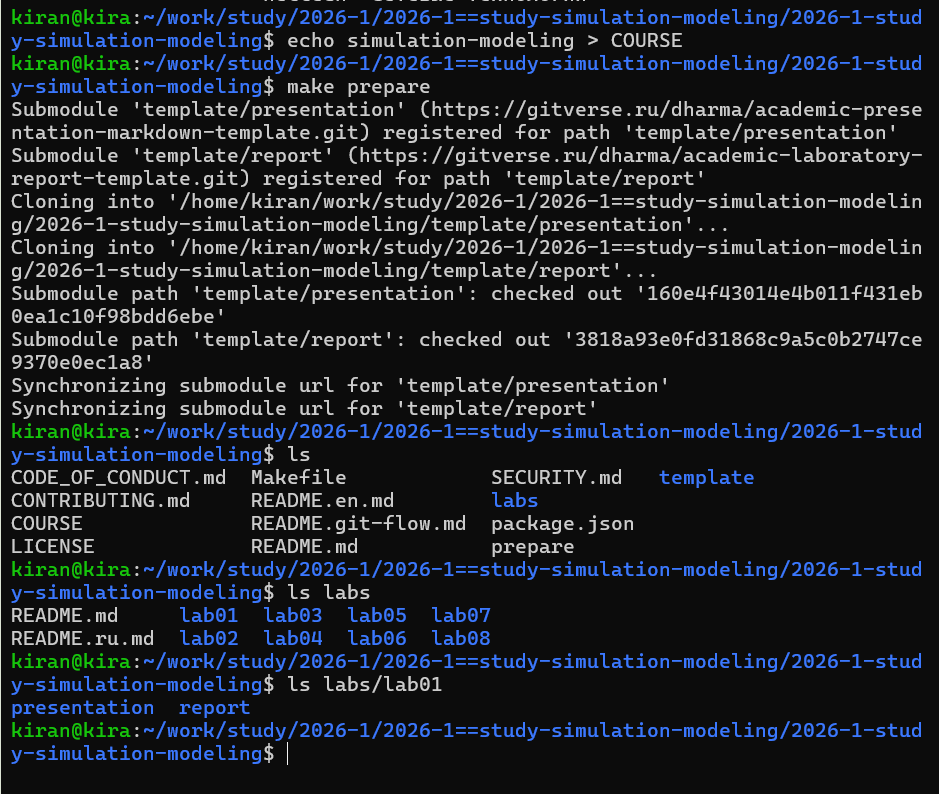
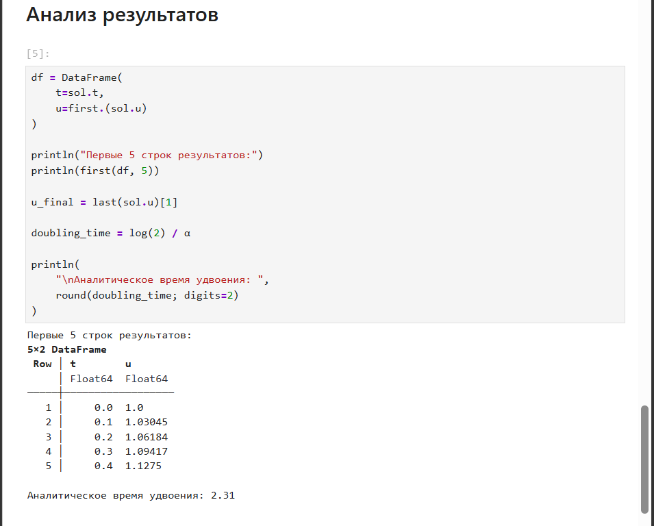

---
## Author
author:
  name: Нечаева Кира Андреевна
  email: knechaeva.git@gmail.com
  affiliation:
    - name: Российский университет дружбы народов
      country: Российская Федерация
      postal-code: 117198
      city: Москва
      address: ул. Миклухо-Маклая, д. 6

## Title
title: Лабораторная работа № 1
subtitle: Подготовка стенда и модель экспоненциального роста
license: CC BY
date: today
date-format: "YYYY-MM-DD"

toc: false
---

## Цель и задачи

**Цель:** подготовить рабочее пространство для лабораторных работ
по имитационному моделированию и освоить инструменты воспроизводимых
вычислительных исследований в Julia.

**Задачи:**

- настроить структуру курса и Git Flow;
- создать проект DrWatson;
- реализовать модель экспоненциального роста;
- провести параметрическое исследование;
- сформировать Literate, Quarto и Jupyter Notebook;
- проверить воспроизводимость вычислений.

## Рабочее пространство

:::: {.columns align=center}

::: {.column width="40%"}

В ходе подготовки были созданы:

- репозиторий курса;
- стандартная структура лабораторных работ;
- ветки `master` и `develop`;
- релиз `v1.0.0`;
- удалённые репозитории GitVerse и GitHub.

:::

::: {.column width="60%"}

{width=100%}

:::

::::

## Проект DrWatson

:::: {.columns align=center}

::: {.column width="42%"}

Для лабораторной работы создан отдельный Julia-проект.

Использованы библиотеки:

- `DifferentialEquations`;
- `Plots`;
- `DataFrames`;
- `JLD2`;
- `Literate`;
- `IJulia`;
- `BenchmarkTools`;
- `Quarto`.

:::

::: {.column width="58%"}

{width=100%}

:::

::::

## Модель экспоненциального роста

:::: {.columns align=center}

::: {.column width="35%"}

Рассматривается модель

$$
\frac{du}{dt}=\alpha u.
$$

Базовые параметры:

$$
u_0=1,
\qquad
\alpha=0.3,
$$

$$
t\in[0,10].
$$

При положительном $\alpha$ величина возрастает экспоненциально.

:::

::: {.column width="65%"}

{width=100%}

:::

::::

## Литературное программирование

:::: {.columns align=center}

::: {.column width="38%"}

Один исходный Julia-файл используется для автоматического создания:

- чистого Julia-кода;
- документа Quarto;
- Jupyter Notebook.

Так все представления программы формируются из одного исходника.

:::

::: {.column width="62%"}

{width=100%}

:::

::::

## Проверка воспроизводимости

:::: {.columns align=center}

::: {.column width="37%"}

Сгенерированный Jupyter Notebook был выполнен с использованием ядра Julia.

Это позволяет проверить, что вычисления можно повторно выполнить
из автоматически созданного notebook.

:::

::: {.column width="63%"}

{width=100%}

:::

::::

## Параметрическое исследование

:::: {.columns align=center}

::: {.column width="30%"}

Исследованы значения

$$
\alpha =
0.1,\;
0.3,\;
0.5,\;
0.8,\;
1.0.
$$

При увеличении $\alpha$ рост происходит значительно быстрее.

:::

::: {.column width="70%"}

{width=100%}

:::

::::

## Влияние параметра $\alpha$

:::: {.columns align=center}

::: {.column width="30%"}

С увеличением коэффициента роста $\alpha$ время удвоения уменьшается.

Для исследованных значений параметра численные результаты совпадают
с теоретической зависимостью

$$
t_2=\frac{\ln 2}{\alpha}.
$$

:::

::: {.column width="70%"}

{width=100%}

:::

::::

## Результаты параметрического исследования

:::: {.columns align=center}

::: {.column width="38%"}

Для всех пяти значений $\alpha$ автоматически выполнены вычисления
и сохранены результаты.

Получены:

- сводная таблица;
- сравнительные траектории;
- время удвоения;
- результаты бенчмаркинга.

:::

::: {.column width="62%"}

{width=100%}

:::

::::

## Бенчмаркинг

:::: {.columns align=center}

::: {.column width="30%"}

Для каждого значения $\alpha$ измерялось время численного решения.

Бенчмаркинг позволяет оценить вычислительные затраты при выполнении
серии экспериментов.

:::

::: {.column width="70%"}

{width=100%}

:::

::::

## Результаты разработки

:::: {.columns align=center}

::: {.column width="40%"}

Для обеих версий программы получены:

- исполняемый Julia-код;
- Quarto-документация;
- Jupyter Notebook;
- сохранённые данные;
- графики результатов.

Параметрический notebook также успешно выполнен.

:::

::: {.column width="60%"}

{width=100%}

:::

::::

## Итог

Для лабораторной работы подготовлено полное воспроизводимое
вычислительное окружение.

- создано рабочее пространство курса;
- настроен и проверен проект DrWatson;
- реализована модель экспоненциального роста;
- выполнено исследование для пяти значений $\alpha$;
- увеличение $\alpha$ ускоряет рост и уменьшает время удвоения;
- код преобразован в Literate, Quarto и Jupyter Notebook;
- результаты сохранены в GitVerse и GitHub.

**Все этапы лабораторной работы выполнены программно и воспроизводимы.**
