---
## Author
author:
  name: Нечаева Кира
  email: knechaeva.git@gmail.com
  affiliation:
    - name: Российский университет дружбы народов
      country: Российская Федерация
      postal-code: 117198
      city: Москва
      address: ул. Миклухо-Маклая, д. 6

## Title
title: "Лабораторная работа № 1"
subtitle: "Подготовка стенда и исследование модели экспоненциального роста"
license: "CC BY"
---

# Введение

## Цель работы

Цель работы — подготовить рабочее пространство для выполнения лабораторных
работ по имитационному моделированию и освоить основные инструменты
воспроизводимых вычислительных исследований в Julia.

В рамках работы необходимо создать структуру курса, настроить Git и Git Flow,
создать проект DrWatson, реализовать модель экспоненциального роста,
преобразовать программный код в литературный стиль и получить на его основе
чистый Julia-код, документацию Quarto и Jupyter Notebook.

## Используемые программные средства

Работа выполнялась в среде Ubuntu через WSL на Windows.

Использованы:

- Julia;
- DrWatson;
- DifferentialEquations;
- Plots;
- DataFrames;
- JLD2;
- Literate;
- IJulia;
- BenchmarkTools;
- Quarto;
- Git и Git Flow;
- GitVerse и GitHub.

# Выполнение лабораторной работы

## Настройка рабочего пространства курса

В начале работы были проверены настройки Git: имя пользователя,
адрес электронной почты и название основной ветки.

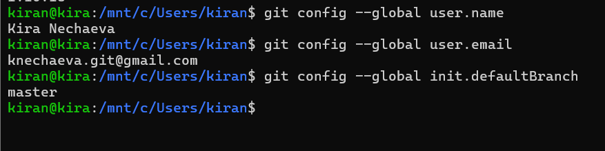{#fig-git-config width=95%}

На GitVerse на основе предложенного шаблона был создан публичный репозиторий
курса `2026-1-study-simulation-modeling`.

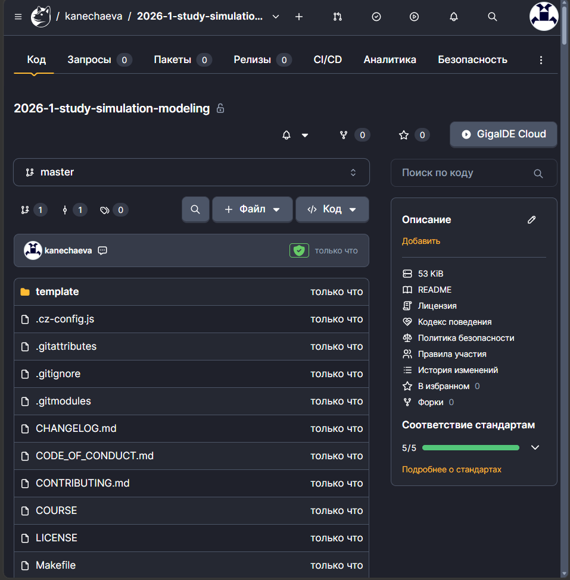{#fig-gitverse width=95%}

После клонирования репозитория была сформирована стандартная структура курса
для дисциплины `simulation-modeling`.

{#fig-course-structure width=95%}

Для репозитория были настроены два удалённых хранилища:
GitVerse и GitHub.

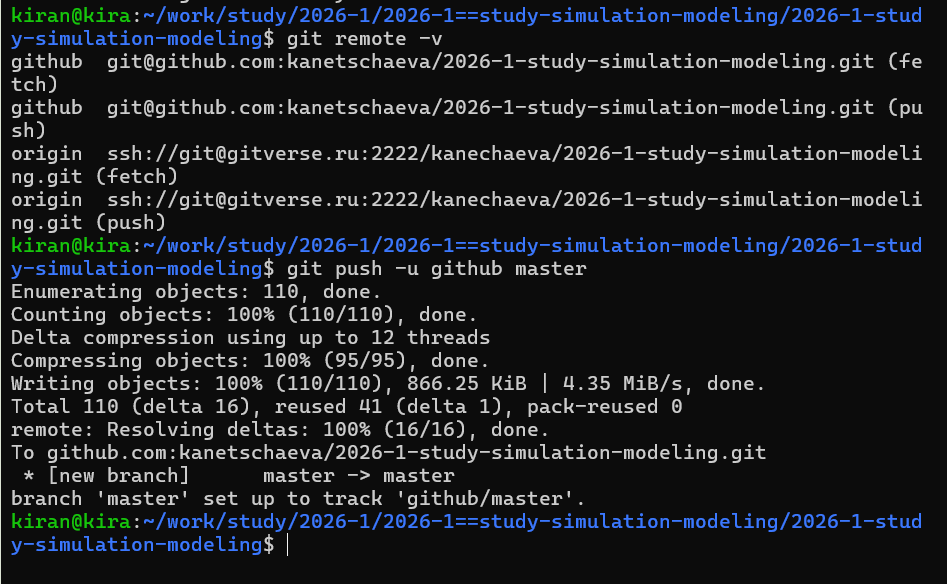{#fig-remotes width=95%}

Для организации разработки был инициализирован Git Flow.
Основной рабочей веткой стала ветка `develop`.

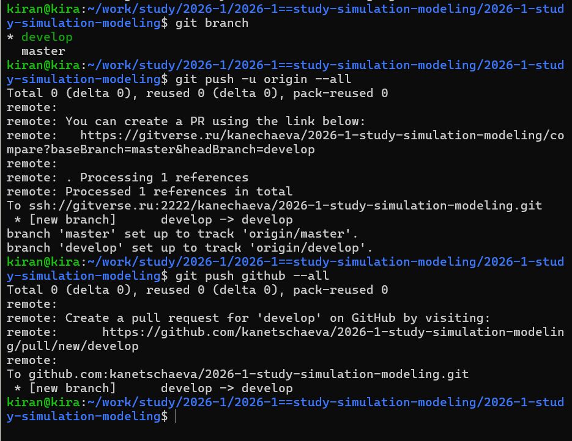{#fig-gitflow width=95%}

Для первоначальной версии рабочего пространства был сформирован
релиз `1.0.0` и создан тег `v1.0.0`.

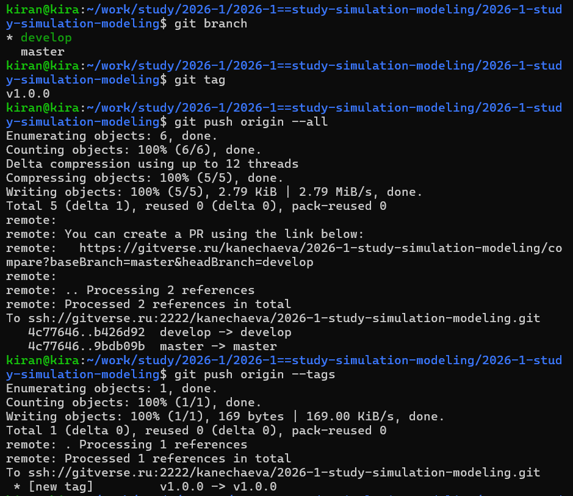{#fig-release width=95%}

Релиз `v1.0.0` также был опубликован на GitHub.

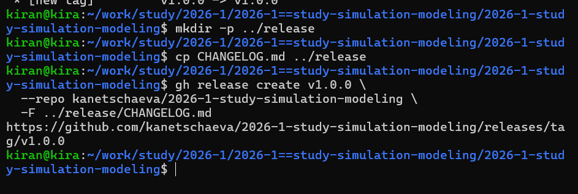{#fig-github-release width=95%}

## Создание проекта DrWatson

В каталоге первой лабораторной работы был создан отдельный проект DrWatson.
В локальное окружение проекта были установлены библиотеки,
необходимые для выполнения вычислений, визуализации результатов,
литературного программирования и создания Jupyter Notebook.

Работоспособность библиотек была проверена тестовым Julia-скриптом.

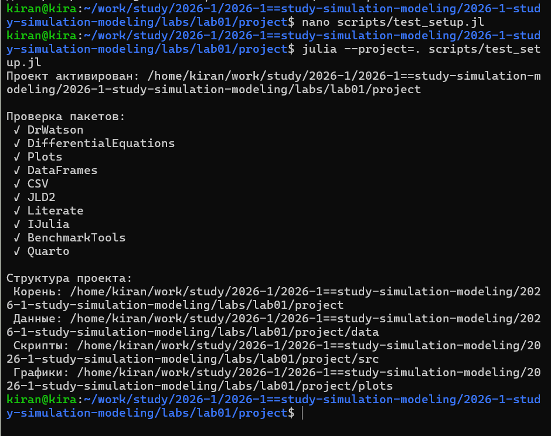{#fig-packages width=95%}

После инициализации была получена стандартная структура проекта DrWatson
с отдельными каталогами для исходного кода, данных, графиков и документации.

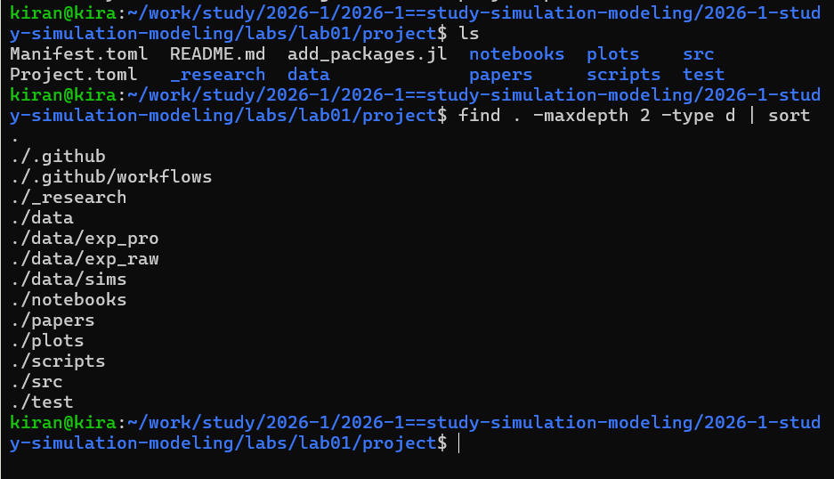{#fig-drwatson width=95%}

# Модель экспоненциального роста

В качестве первой вычислительной модели использовалась модель
экспоненциального роста

$$
\frac{du}{dt}=\alpha u.
$$

Для базового эксперимента были заданы начальное значение
$u_0=1$, параметр $\alpha=0.3$ и временной интервал от 0 до 10.

Численное решение было получено средствами пакета DifferentialEquations.

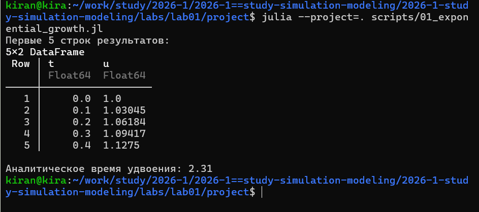{#fig-base-terminal width=95%}

Полученная траектория имеет характерную для экспоненциального роста форму.

{#fig-base-growth width=80%}

## Литературная реализация базовой модели

Исходный Julia-скрипт был преобразован в литературный стиль.
На его основе автоматически формируются исполняемый код,
документ Quarto и Jupyter Notebook.



## Генерация производных форматов

С помощью Literate из одного исходного файла были автоматически
сгенерированы три представления программы: чистый Julia-скрипт,
Quarto-документация и Jupyter Notebook.

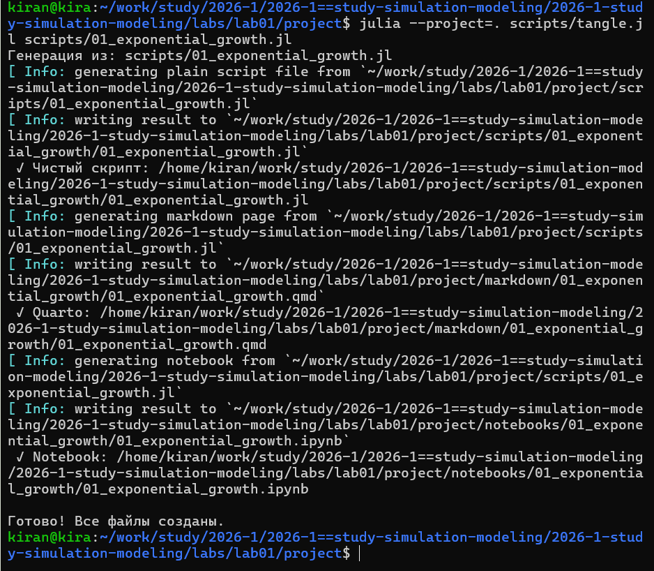{#fig-literate-base width=95%}

После генерации была проверена структура созданных файлов.

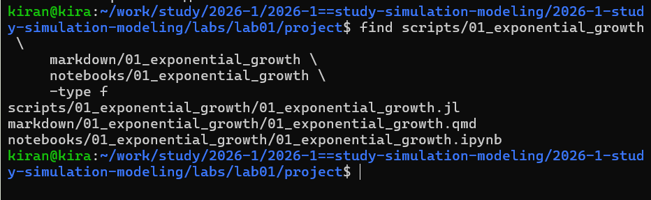{#fig-generated-base width=95%}

Полученный Jupyter Notebook был открыт с использованием ядра Julia
и выполнен полностью.

{#fig-notebook-base width=95%}

# Параметрическое исследование

Во второй версии программы параметры эксперимента были организованы
средствами DrWatson.

Было исследовано пять значений коэффициента роста:

$$
\alpha \in \{0.1,\;0.3,\;0.5,\;0.8,\;1.0\}.
$$

Для каждого набора параметров автоматически выполнялось моделирование,
а результаты сохранялись для последующего анализа.

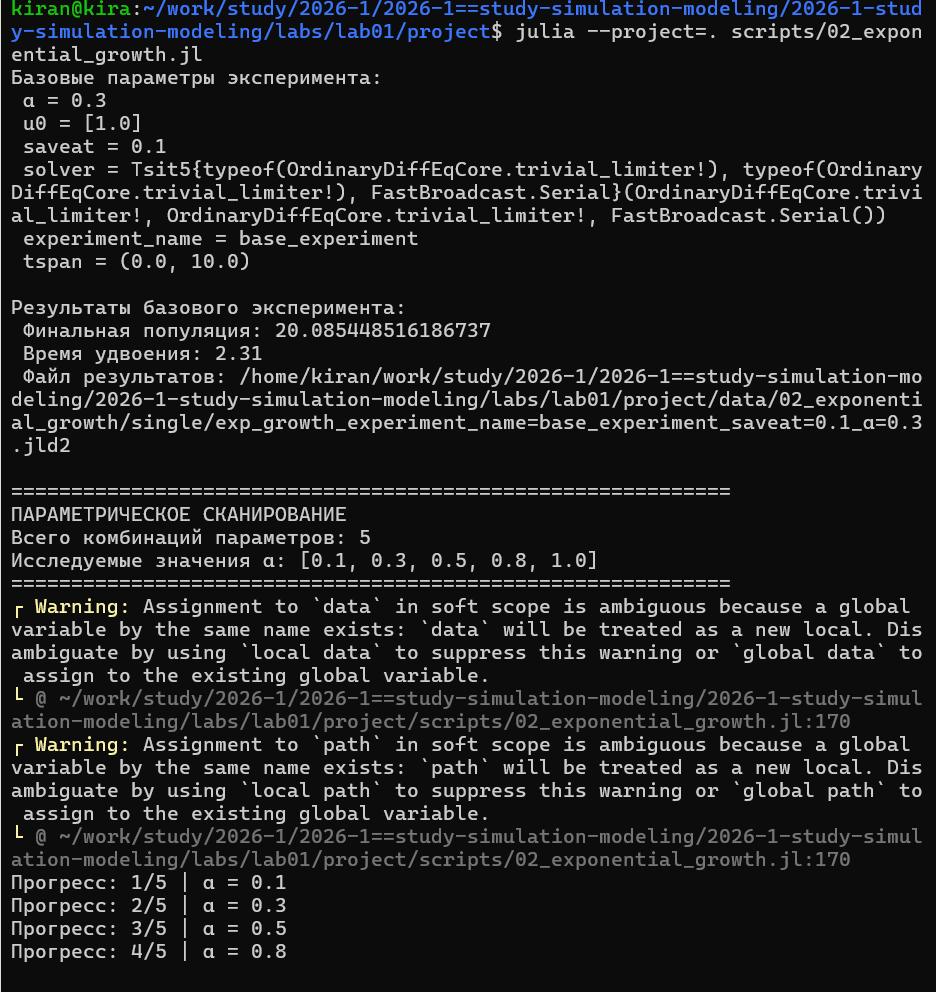{#fig-param-results width=95%}

Выполнение программы завершилось успешно, после чего были сохранены
данные и графики экспериментов.

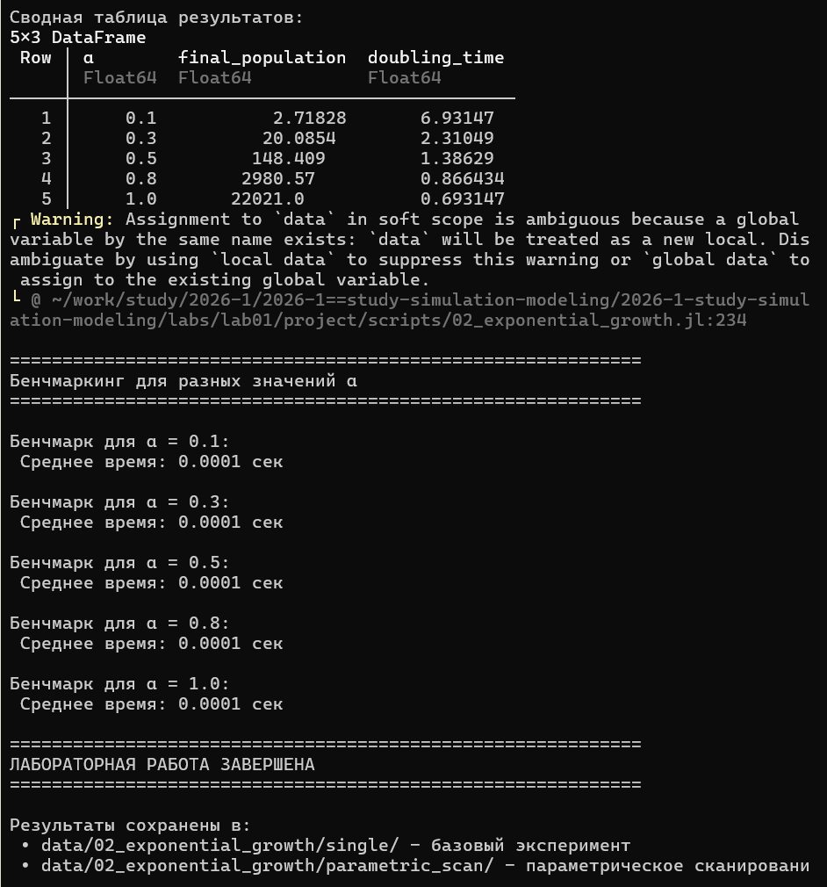{#fig-param-completed width=95%}

## Анализ результатов параметрического исследования

На сравнительном графике видно, что увеличение коэффициента
$\alpha$ приводит к более быстрому росту исследуемой величины.

{#fig-param-comparison width=85%}

Зависимость времени удвоения от коэффициента роста имеет убывающий характер:
при увеличении $\alpha$ время удвоения уменьшается.

{#fig-doubling width=85%}

Также был выполнен бенчмаркинг численного решения для различных
значений параметра.

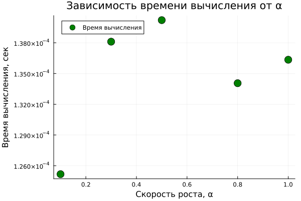{#fig-computation width=85%}

## Литературная реализация параметрического исследования

Для параметрической версии также была создана литературная реализация,
из которой формируются исполняемый Julia-код, документация Quarto
и Jupyter Notebook.



## Производные форматы параметрической модели

Для параметрической программы были автоматически созданы
все требуемые производные форматы.

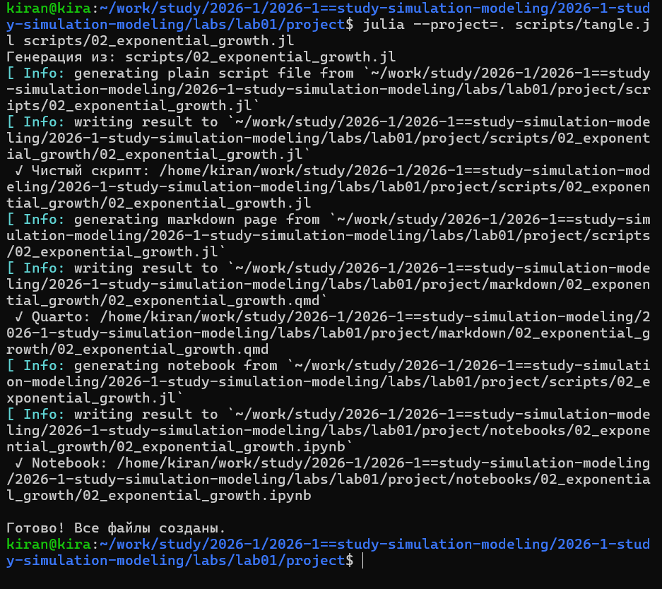{#fig-literate-param width=95%}

Сгенерированный Jupyter Notebook был выполнен полностью
с использованием ядра Julia.

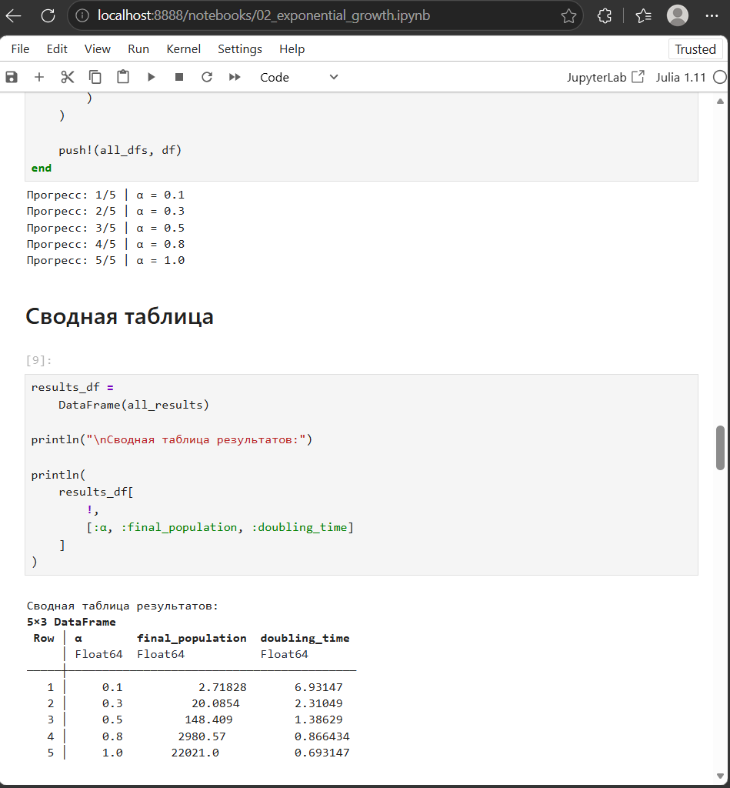{#fig-notebook-param width=95%}

# Итоговая структура проекта

После выполнения вычислительной части были проверены созданные
исходные файлы, данные, графики, Quarto-документы и Jupyter Notebook.

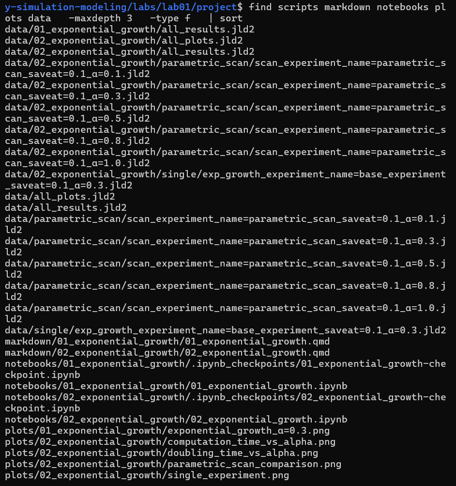{#fig-final-files width=95%}

Результаты лабораторной работы были зафиксированы в системе Git
и отправлены в удалённые репозитории.

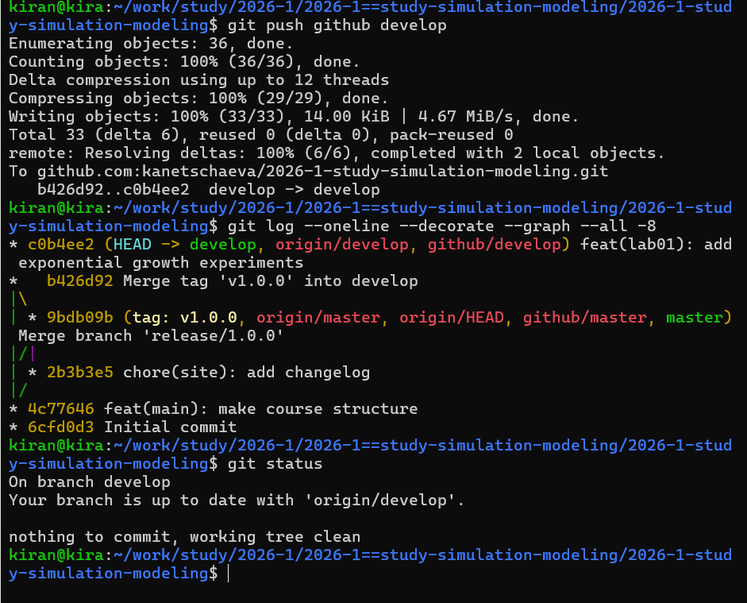{#fig-final-git width=95%}

# Заключение

В ходе лабораторной работы было подготовлено рабочее пространство курса
по имитационному моделированию и настроена система контроля версий.

Для лабораторной работы создан отдельный проект DrWatson и локальное
окружение Julia с необходимыми библиотеками.

Реализована модель экспоненциального роста. Выполнен базовый эксперимент
при $\alpha=0.3$ и параметрическое исследование для пяти значений
коэффициента роста.

С использованием Literate из исходных программ были получены чистые
Julia-скрипты, документация Quarto и Jupyter Notebook. Оба notebook
были выполнены.

По результатам параметрического исследования установлено, что увеличение
коэффициента $\alpha$ приводит к более быстрому экспоненциальному росту
и уменьшению времени удвоения величины.

Таким образом, все задания лабораторной работы выполнены.
