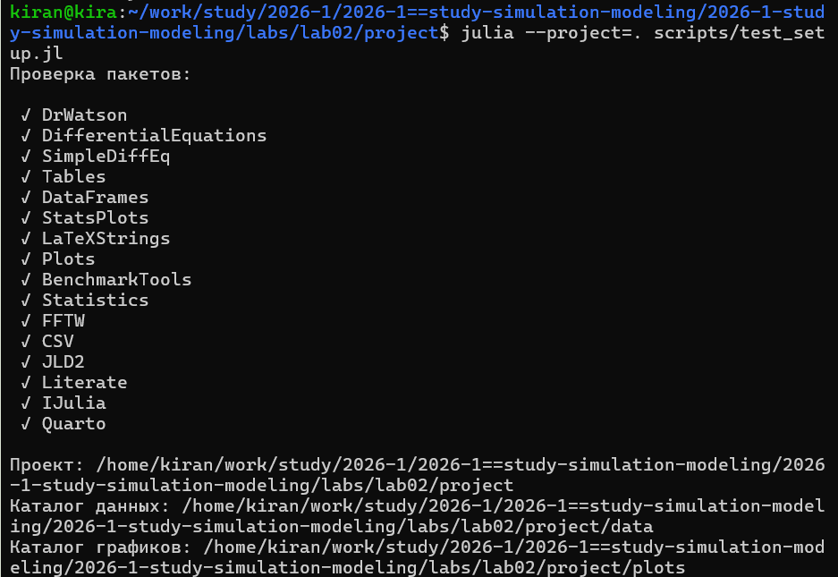
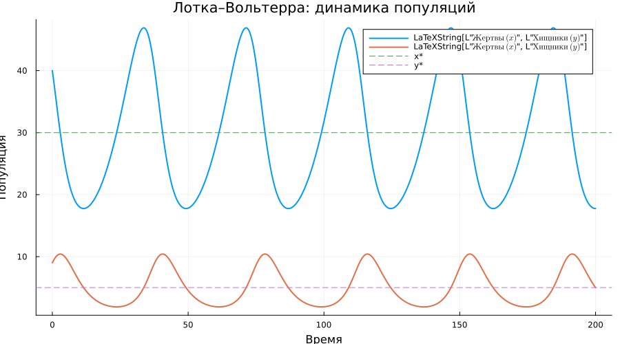
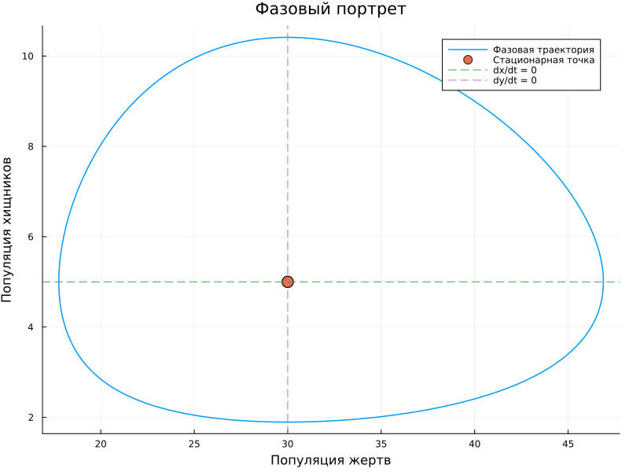
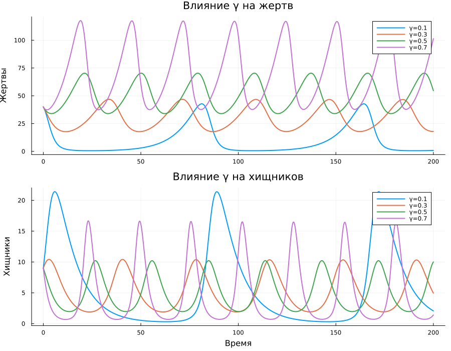

## Цель работы

**Цель:** реализовать и исследовать две системы имитационного
моделирования средствами Julia.

В работе:

- реализована эпидемиологическая модель SIR;
- реализована модель Лотки–Вольтерры;
- проведены параметрические эксперименты;
- построены графики результатов;
- код преобразован в Julia, Quarto и Jupyter Notebook.

## Рабочее окружение

:::: {.columns align=center}

::: {.column width="38%"}

Для работы создан отдельный проект DrWatson.

Использованы:

- `DifferentialEquations`;
- `DataFrames`;
- `Plots`;
- `StatsPlots`;
- `BenchmarkTools`;
- `FFTW`;
- `Literate`;
- `IJulia`.

:::

::: {.column width="62%"}

{width=100%}

:::

::::

## Модель SIR

:::: {.columns align=center}

::: {.column width="35%"}

Популяция разделяется на три группы:

- $S$ — восприимчивые;
- $I$ — инфицированные;
- $R$ — выздоровевшие.

Базовые параметры:

$$
\beta=0.05,\qquad
c=10,\qquad
\gamma=0.25.
$$

В базовом эксперименте

$$
R_0=\frac{c\beta}{\gamma}=2.
$$

:::

::: {.column width="65%"}

{width=100%}

:::

::::

## Динамика эпидемии

:::: {.columns align=center}

::: {.column width="32%"}

В начале число инфицированных увеличивается.

По мере сокращения числа восприимчивых эффективное репродуктивное
число уменьшается.

Когда $R_e<1$, распространение инфекции начинает затухать.

:::

::: {.column width="68%"}

{width=100%}

:::

::::

## Параметрическое исследование SIR

:::: {.columns align=center}

::: {.column width="30%"}

В серии экспериментов изменялось среднее число контактов $c$.

Остальные параметры сохранялись постоянными.

Так можно отдельно оценить влияние интенсивности контактов
на развитие эпидемии.

:::

::: {.column width="70%"}

{width=100%}

:::

::::

## Воспроизводимость SIR

:::: {.columns align=center}

::: {.column width="36%"}

Один литературный исходник автоматически преобразован в:

- исполняемый Julia-код;
- Quarto-документ;
- Jupyter Notebook.

Обе версии SIR были выполнены в Jupyter.

:::

::: {.column width="64%"}

{width=100%}

:::

::::

## Модель Лотки–Вольтерры

:::: {.columns align=center}

::: {.column width="34%"}

Модель описывает взаимодействие двух популяций:

- $x$ — жертвы;
- $y$ — хищники.

Параметры:

$$
\alpha=0.1,\quad
\beta=0.02,
$$

$$
\delta=0.01,\quad
\gamma=0.3.
$$

Начальное состояние:

$$
x_0=40,\qquad y_0=9.
$$

:::

::: {.column width="66%"}

{width=100%}

:::

::::

## Циклическая динамика

:::: {.columns align=center}

::: {.column width="31%"}

Сначала увеличивается число жертв.

Рост числа жертв создаёт больше ресурсов для хищников, поэтому
их максимум наступает позже.

После роста хищников численность жертв снова уменьшается,
и цикл повторяется.

:::

::: {.column width="69%"}

{width=95%}

:::

::::

## Параметрическое исследование

:::: {.columns align=center}

::: {.column width="30%"}

Отдельно исследовались:

**$\alpha$** — скорость естественного роста жертв;

**$\gamma$** — скорость естественной смертности хищников.

При изменении параметров меняются амплитуда и характер
колебаний системы.

:::

::: {.column width="70%"}

{width=100%}

:::

::::

## Влияние смертности хищников

:::: {.columns align=center}

::: {.column width="30%"}

При изменении $\gamma$ изменяется скорость уменьшения
популяции хищников.

Это влияет не только на численность хищников,
но и на последующую динамику жертв.

:::

::: {.column width="70%"}

{width=100%}

:::

::::

## Литературное программирование

:::: {.columns align=center}

::: {.column width="38%"}

Для обеих моделей и их параметрических версий сформированы:

- чистые Julia-скрипты;
- Quarto-документация;
- Jupyter Notebook;
- данные;
- графики.

:::

::: {.column width="62%"}

{width=100%}

:::

::::

## Итоговая структура

:::: {.columns align=center}

::: {.column width="37%"}

В результате получен воспроизводимый проект,
в котором исходный код, результаты вычислений,
графики и документация связаны между собой.

Все результаты сохранены в системе контроля версий.

:::

::: {.column width="63%"}

{width=100%}

:::

::::

## Выводы

В лабораторной работе были реализованы две модели.

- SIR показывает переход населения между группами
  восприимчивых, инфицированных и выздоровевших.
- Уменьшение числа контактов снижает скорость распространения инфекции.
- Модель Лотки–Вольтерры демонстрирует циклическое взаимодействие
  хищников и жертв.
- Изменение параметров $\alpha$ и $\gamma$ заметно меняет динамику системы.
- Все вычисления оформлены как воспроизводимый Julia-проект.

**Исходный код, результаты и документация формируются программно.**
