---
author:
  name: Нечаева Кира Андреевна
  email: knechaeva.git@gmail.com
  affiliation:
    - name: Российский университет дружбы народов
      country: Российская Федерация
      postal-code: 117198
      city: Москва
      address: ул. Миклухо-Маклая, д. 6

title: "Лабораторная работа № 2"
subtitle: "Исследование моделей SIR и Лотки–Вольтерры"

license: "CC BY"

abstract: |
  В лабораторной работе реализованы и исследованы две системы имитационного
  моделирования: эпидемиологическая модель SIR и модель взаимодействия
  популяций Лотки–Вольтерры.

  Для обеих моделей выполнено численное решение систем дифференциальных
  уравнений, построены графики и проведены параметрические эксперименты.

  Программный код оформлен в литературном стиле. На его основе сформированы
  чистые Julia-скрипты, документы Quarto и Jupyter Notebook.

keywords:
  - имитационное моделирование
  - Julia
  - SIR
  - Лотка–Вольтерра
  - DifferentialEquations
  - DrWatson
  - Literate
---

# Введение

Цель лабораторной работы — освоить реализацию и исследование систем
дифференциальных уравнений средствами Julia на примере моделей SIR
и Лотки–Вольтерры.

В работе использовано воспроизводимое окружение DrWatson.
Расчёты выполнялись с помощью пакета DifferentialEquations,
а результаты сохранялись в виде данных и графиков.

Программы были дополнительно оформлены в литературном стиле,
после чего из одного исходного файла автоматически формировались
чистый Julia-код, документация Quarto и Jupyter Notebook.

# Подготовка рабочего окружения

Работа выполнялась в существующем репозитории курса в ветке `develop`.

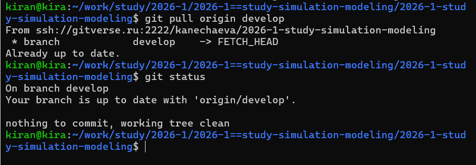{width=88% fig-cap="Начало выполнения лабораторной работы № 2"}

Для лабораторной работы было создано отдельное окружение DrWatson.
Перед выполнением моделей была проверена загрузка всех необходимых пакетов.

{width=88% fig-cap="Проверка программного окружения"}

Структура проекта содержит отдельные каталоги для программ,
данных, графиков, notebooks и документации.

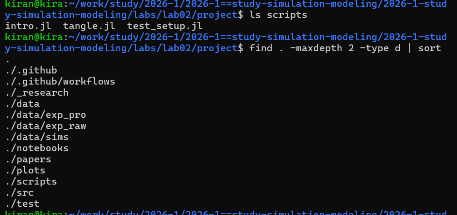{width=88% fig-cap="Структура проекта лабораторной работы"}

# Модель SIR

## Базовый эксперимент

Первая исследуемая система — трёхпараметрическая модель SIR.
В ней население разделяется на восприимчивых, инфицированных
и выздоровевших.

Использовались параметры:

- вероятность передачи инфекции $\beta=0.05$;
- среднее число контактов $c=10$;
- скорость выздоровления $\gamma=0.25$;
- начальные условия $S_0=990$, $I_0=10$, $R_0=0$.

После решения системы программа автоматически определяет базовое
репродуктивное число, максимальное число инфицированных,
момент пика и итоговое количество переболевших.

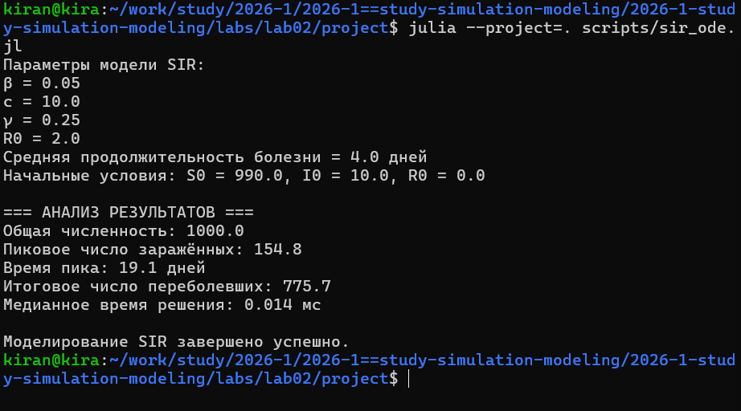{width=88% fig-cap="Результат выполнения базовой модели SIR"}

Основная динамика системы представлена на следующем графике.

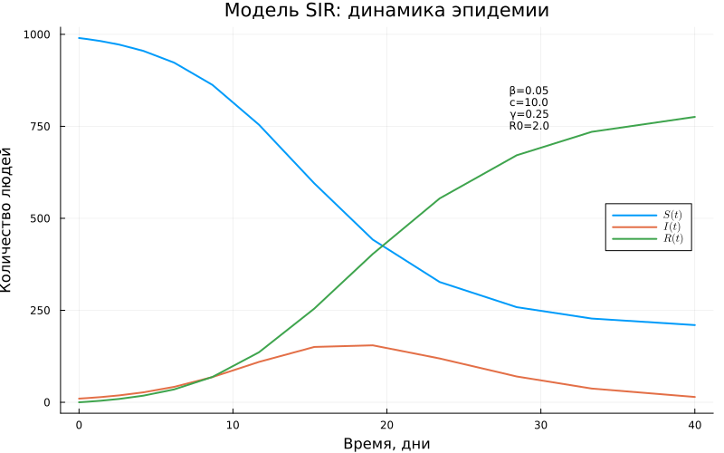{width=88% fig-cap="Динамика групп S, I и R"}

Число восприимчивых постепенно уменьшается, число выздоровевших
возрастает, а количество инфицированных сначала увеличивается,
достигает максимума, после чего снижается.

Отдельно было исследовано эффективное репродуктивное число.

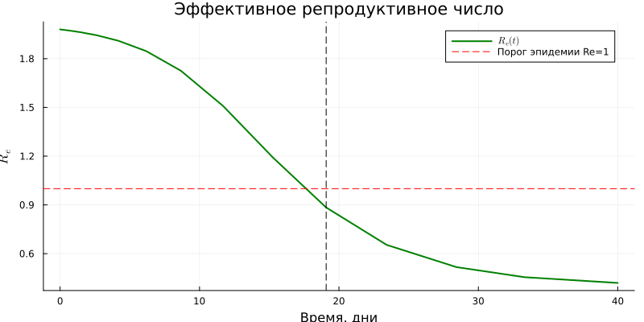{width=88% fig-cap="Динамика эффективного репродуктивного числа"}

По мере уменьшения числа восприимчивых эффективное репродуктивное
число снижается. После перехода ниже единицы дальнейший рост
эпидемии прекращается.

## Литературная версия модели SIR

Базовый Julia-файл был преобразован в литературный стиль.
Из него автоматически сформированы исполняемый Julia-скрипт,
документ Quarto и Jupyter Notebook.

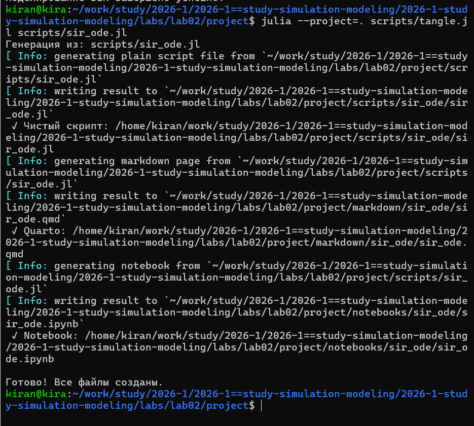{width=88% fig-cap="Генерация производных форматов для модели SIR"}

Ниже интегрирована автоматически созданная Quarto-документация.



# Параметрическое исследование SIR

Для изучения влияния интенсивности социальных контактов было
выполнено несколько расчётов при различных значениях параметра $c$.
Остальные условия модели сохранялись неизменными.

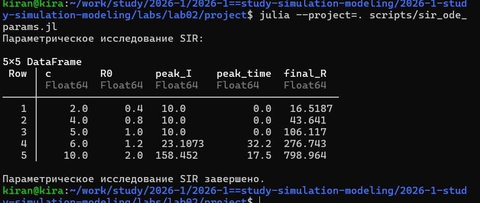{width=88% fig-cap="Результаты параметрического исследования SIR"}

Сравнение траекторий инфицированных:

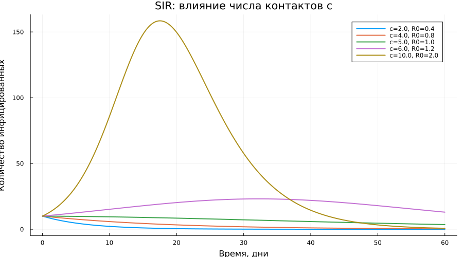{width=88% fig-cap="Влияние числа контактов на распространение инфекции"}

Изменение числа контактов непосредственно изменяет базовое
репродуктивное число и характер эпидемической динамики.

Параметрическая версия также была преобразована в Julia,
Quarto и Jupyter Notebook.



# Проверка модели SIR в Jupyter Notebook

Сгенерированный notebook базовой версии был выполнен с использованием
ядра Julia.

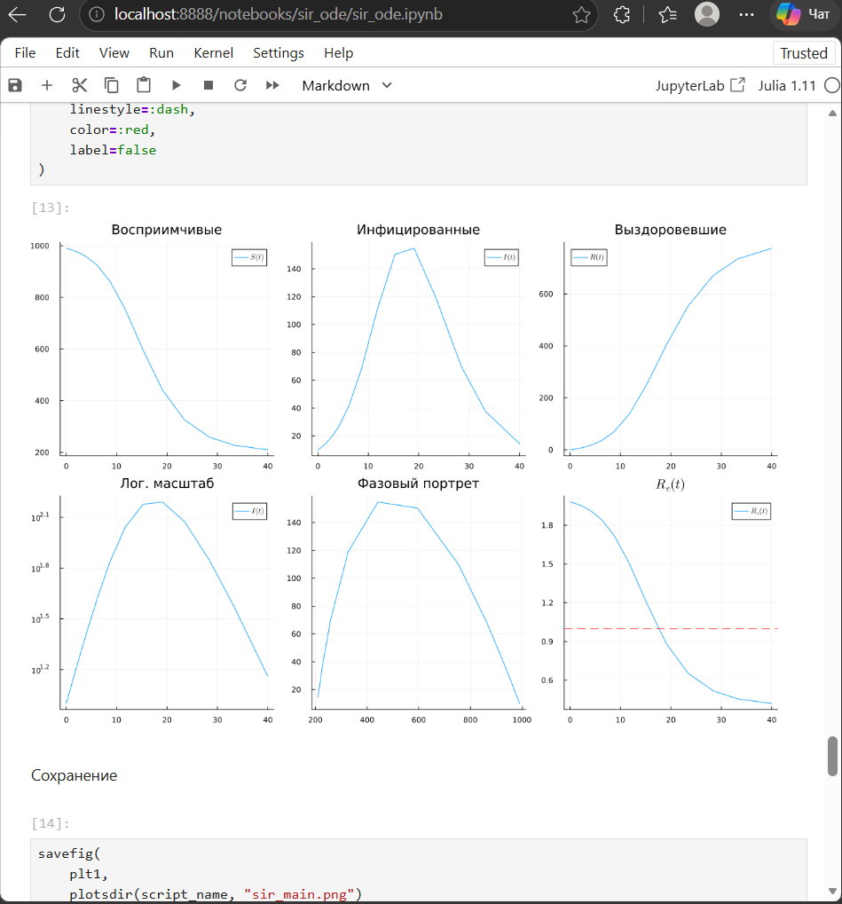{width=88% fig-cap="Выполнение базовой модели SIR в Jupyter Notebook"}

Таким же способом была выполнена параметрическая версия модели.

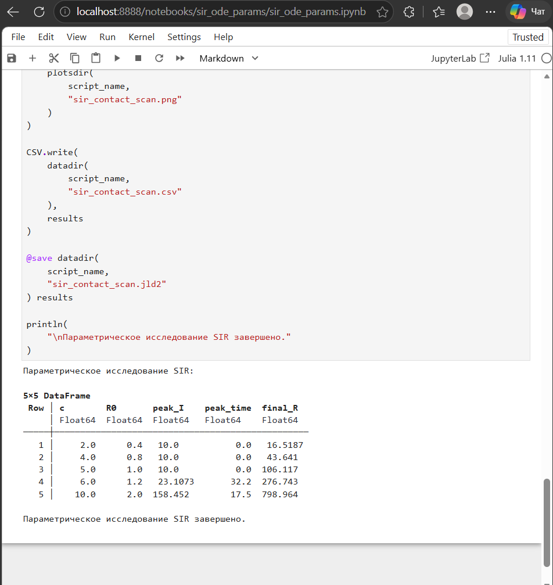{width=88% fig-cap="Выполнение параметрической модели SIR в Jupyter Notebook"}

# Модель Лотки–Вольтерры

## Базовый эксперимент

Вторая модель описывает взаимодействие двух популяций:
жертв и хищников.

В работе использовались параметры

- $\alpha=0.1$ — естественный прирост жертв;
- $\beta=0.02$ — интенсивность взаимодействия с хищниками;
- $\delta=0.01$ — эффективность роста популяции хищников;
- $\gamma=0.3$ — естественная смертность хищников.

Начальные значения популяций составляли 40 жертв и 9 хищников.

Результаты запуска программы представлены ниже.

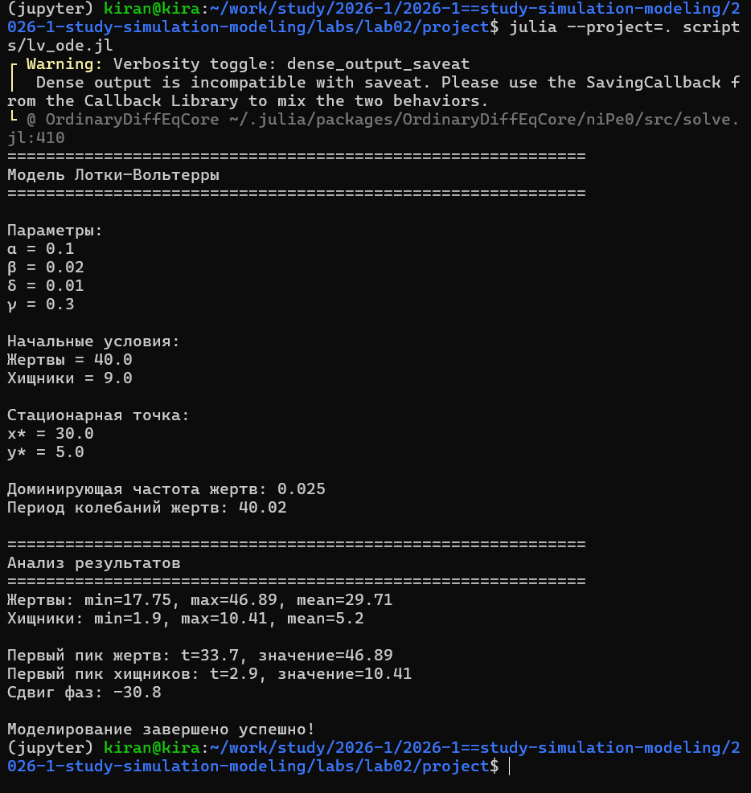{width=88% fig-cap="Выполнение модели Лотки–Вольтерры"}

Динамика обеих популяций:

{width=88% fig-cap="Динамика популяций жертв и хищников"}

Рост численности жертв создаёт условия для последующего роста
численности хищников, поэтому между максимумами двух популяций
возникает временной сдвиг.

Фазовый портрет:

{width=80% fig-cap="Фазовый портрет модели Лотки–Вольтерры"}

Замкнутая траектория на фазовой плоскости отражает циклический
характер взаимодействия двух популяций.

Общая панель результатов:

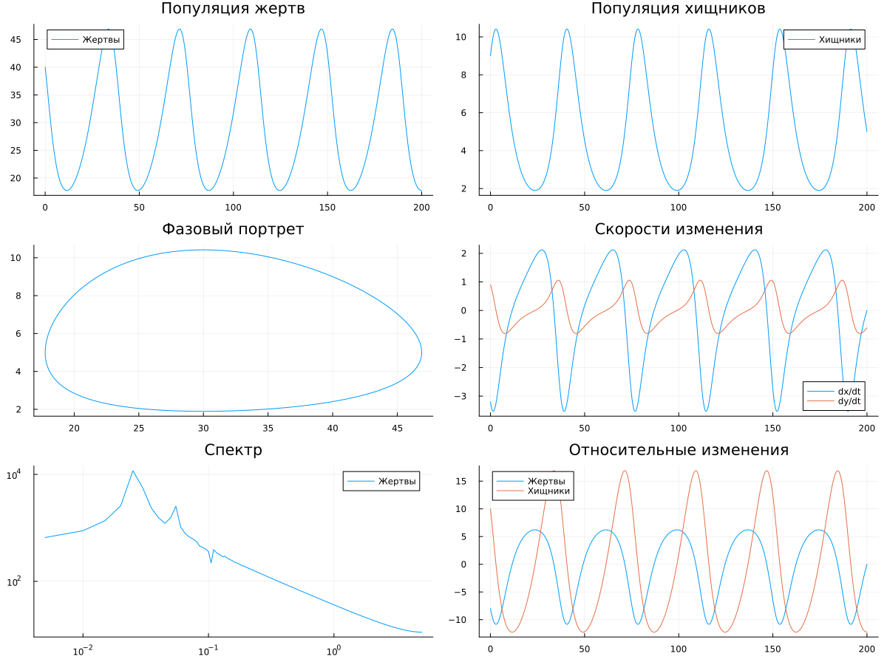{width=90% fig-cap="Комплексная визуализация результатов модели Лотки–Вольтерры"}

## Литературная версия

Исходная программа также была преобразована в литературный стиль.

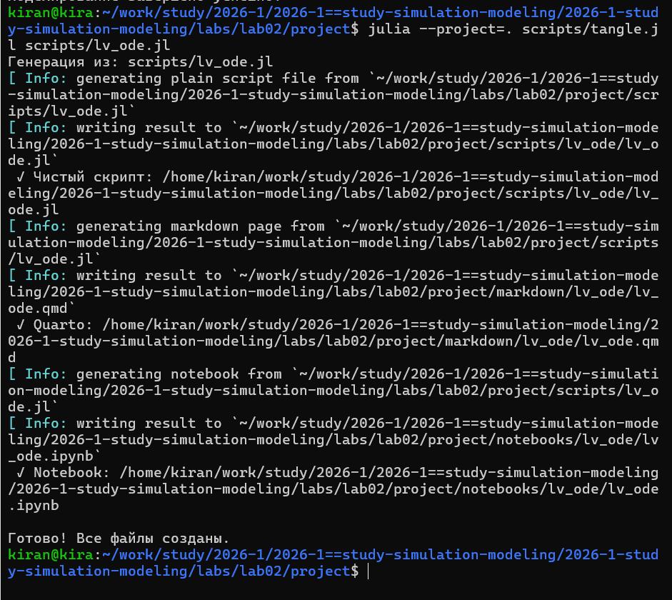{width=88% fig-cap="Генерация Julia, Quarto и Jupyter для модели Лотки–Вольтерры"}

Автоматически сформированная документация:



# Параметрическое исследование модели Лотки–Вольтерры

Для анализа чувствительности модели отдельно изменялись параметры
естественного прироста жертв $\alpha$ и смертности хищников $\gamma$.

Результаты вычислений выводились в сводную таблицу.

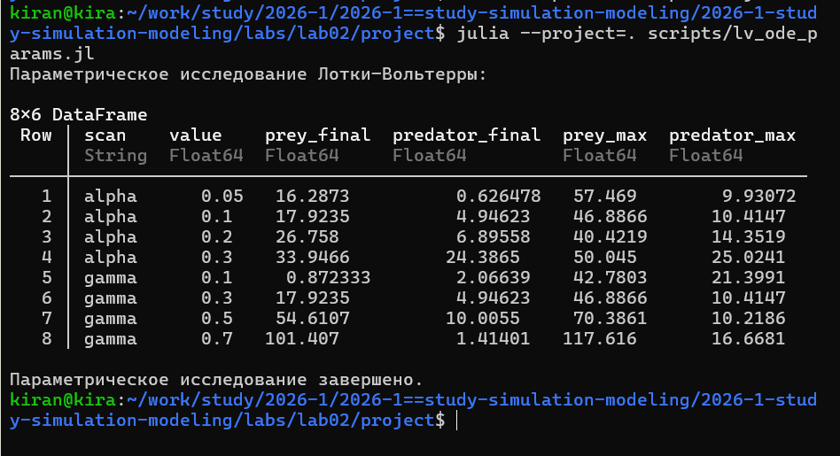{width=88% fig-cap="Выполнение параметрического исследования модели Лотки–Вольтерры"}

Влияние коэффициента $\alpha$:

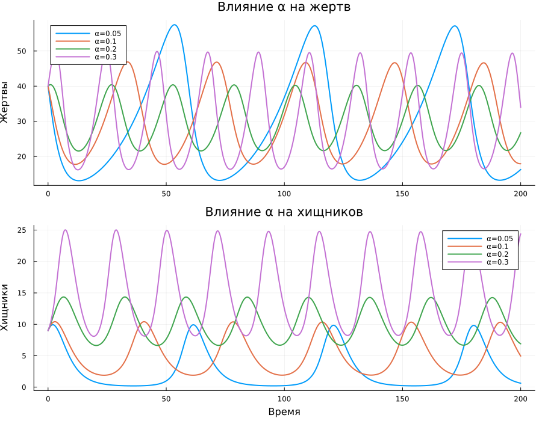{width=90% fig-cap="Чувствительность модели к параметру α"}

Дополнительно исследовалось влияние смертности хищников $\gamma$.

{width=90% fig-cap="Чувствительность модели к параметру γ"}

Параметрический код также был преобразован во все требуемые форматы.



# Проверка в Jupyter Notebook

Базовый notebook модели Лотки–Вольтерры был выполнен с использованием
ядра Julia.

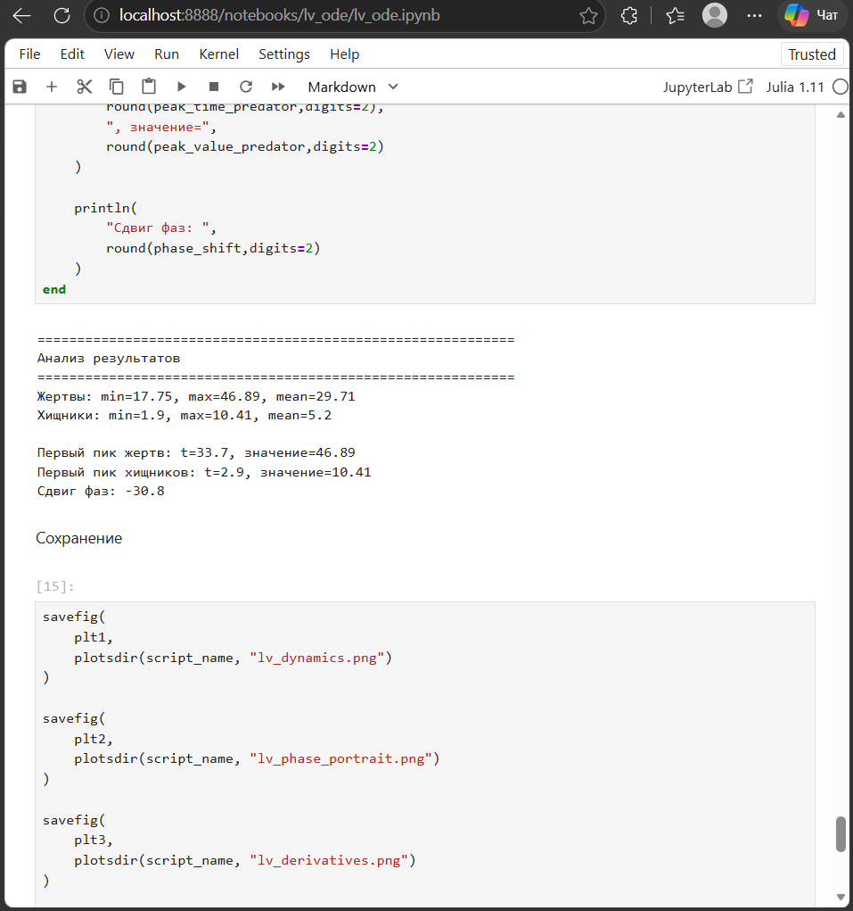{width=88% fig-cap="Выполнение модели Лотки–Вольтерры в Jupyter Notebook"}

Для параметрической программы также был сформирован Jupyter Notebook.
Его наличие вместе с остальными производными файлами проверено
в итоговой структуре проекта.

# Итоговая структура проекта

После выполнения всех этапов были сформированы исходные программы,
чистые Julia-скрипты, документы Quarto, Jupyter Notebook,
численные результаты и графики.

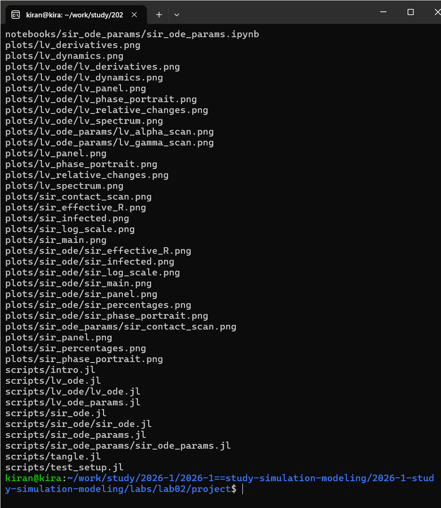{width=88% fig-cap="Итоговый набор файлов лабораторной работы"}

Результаты лабораторной работы сохранены в системе контроля версий.

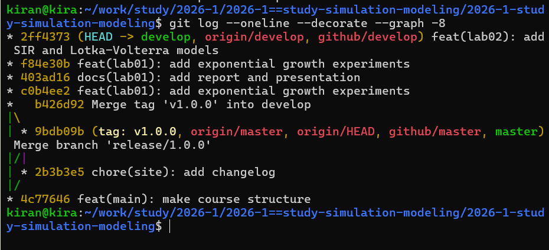{width=88% fig-cap="Фиксация результатов лабораторной работы в Git"}

# Заключение

В лабораторной работе были реализованы две классические системы
имитационного моделирования.

Для модели SIR исследована динамика распространения инфекции
и влияние среднего числа контактов на развитие эпидемии.

Для модели Лотки–Вольтерры исследованы циклические изменения
популяций хищников и жертв, фазовая траектория и чувствительность
системы к параметрам.

Все вычисления выполнены программно в Julia. Для обеспечения
воспроизводимости использована структура DrWatson, а литературный
код автоматически преобразован в Julia, Quarto и Jupyter Notebook.
