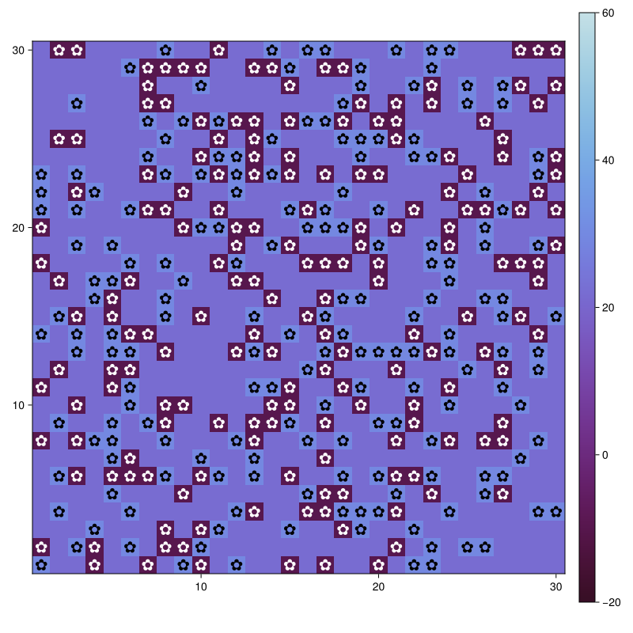
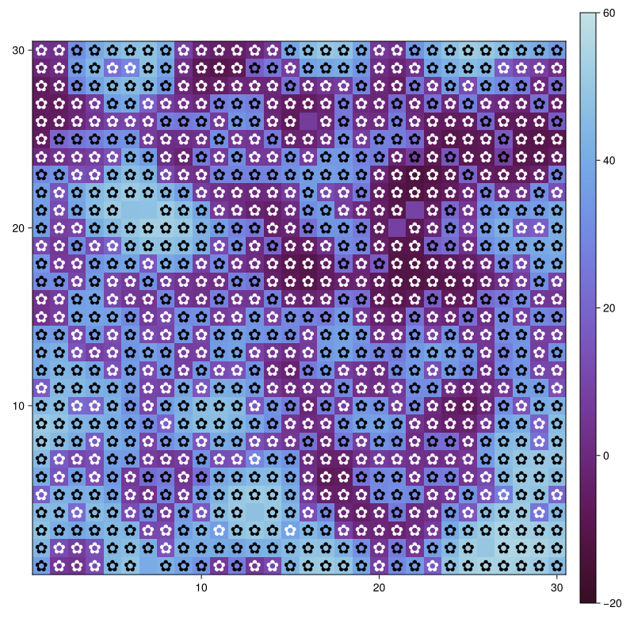
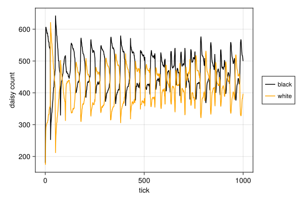
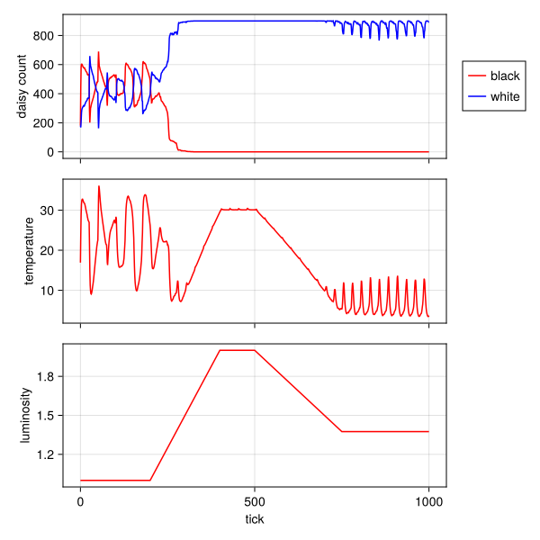
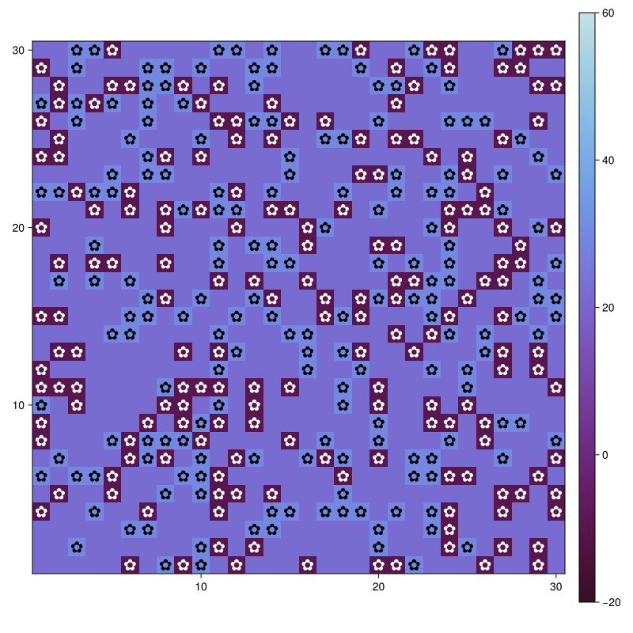
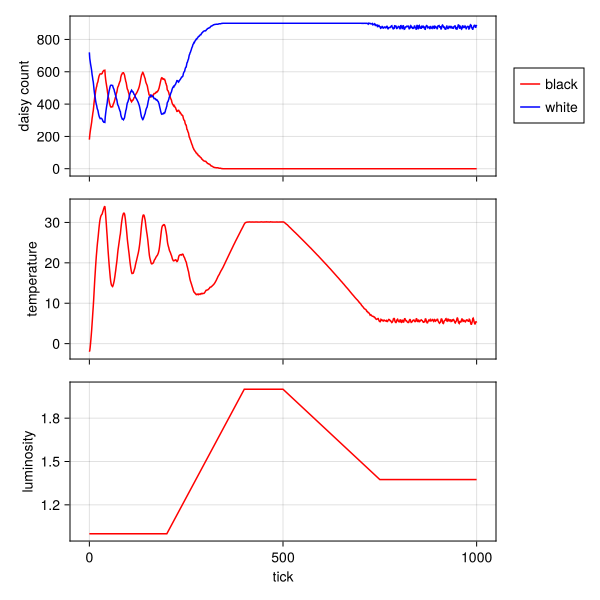
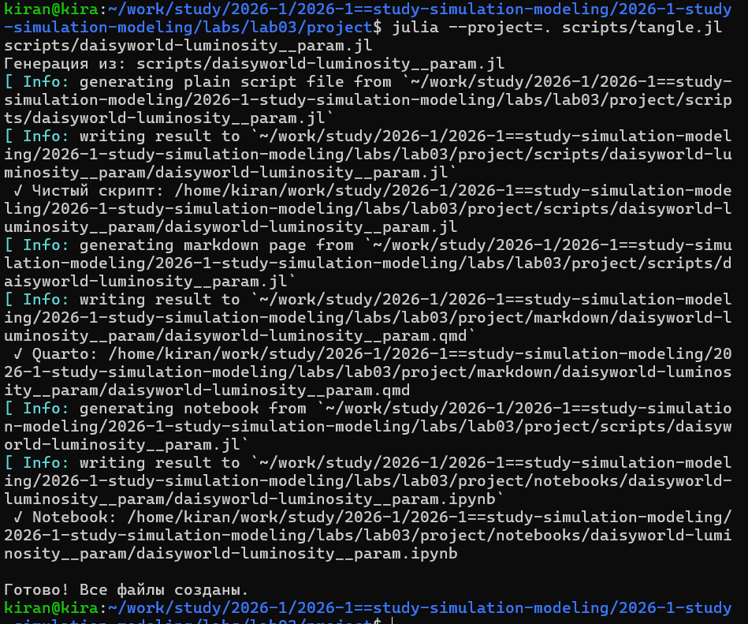
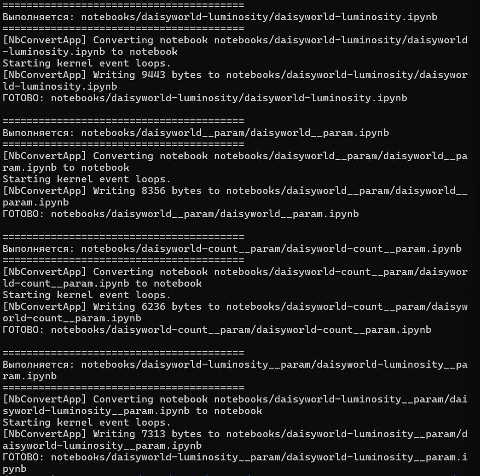
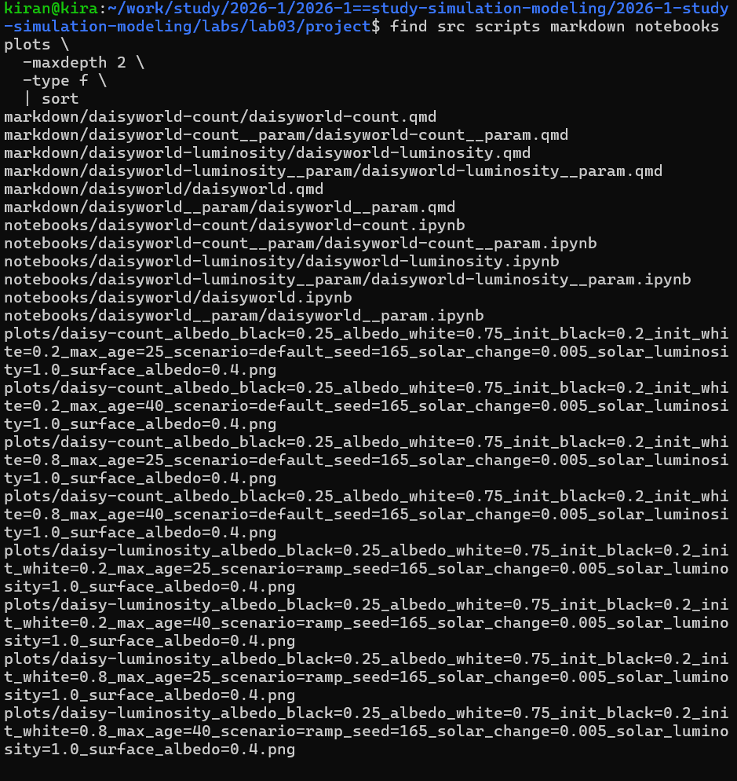

## Цель работы

**Цель:** реализовать и исследовать агентную модель Daisyworld
средствами Julia и `Agents.jl`.

В работе:

- определены агенты и правила их поведения;
- реализована клеточная среда;
- построена визуализация модели;
- исследована численность маргариток;
- проанализирована реакция на изменение светимости;
- проведены параметрические эксперименты.

## Агентный подход

:::: {.columns align=center}

::: {.column width="42%"}

В агентной модели глобальная динамика не задаётся напрямую.

Она возникает из локальных действий отдельных агентов.

В Daisyworld агент — отдельная маргаритка со свойствами:

- вид;
- возраст;
- альбедо.

Среда — клеточная сетка с локальной температурой.

:::

::: {.column width="58%"}

{width=100%}

:::

::::

## Модель Daisyworld

:::: {.columns align=center}

::: {.column width="34%"}

Используются два типа агентов:

**чёрные маргаритки**

- меньше отражают свет;
- сильнее нагревают поверхность;

**белые маргаритки**

- сильнее отражают свет;
- охлаждают поверхность.

Температура влияет на размножение агентов.

:::

::: {.column width="66%"}

{width=88%}

:::

::::

## Эволюция системы

:::: {.columns align=center}

::: {.column width="31%"}

На каждом модельном шаге:

1. обновляется локальная температура;
2. температура распространяется между соседними клетками;
3. маргаритки могут размножаться;
4. агенты стареют и умирают.

Так состояние мира изменяется без задания глобальной траектории.

:::

::: {.column width="69%"}

{width=88%}

:::

::::

## Динамика численности

:::: {.columns align=center}

::: {.column width="31%"}

На протяжении 1000 шагов отдельно собиралось число:

- чёрных маргариток;
- белых маргариток.

После начального переходного процесса система формирует
динамическое состояние, поддерживаемое взаимодействием
агентов и среды.

:::

::: {.column width="69%"}

{width=100%}

:::

::::

## Изменение солнечной светимости

:::: {.columns align=center}

::: {.column width="30%"}

В сценарии `ramp` внешняя солнечная светимость сначала возрастает,
а затем снижается.

Одновременно собираются:

- численность агентов;
- средняя температура;
- светимость.

Это позволяет наблюдать реакцию Daisyworld
на изменение внешних условий.

:::

::: {.column width="70%"}

{width=92%}

:::

::::

## Саморегуляция Daisyworld

:::: {.columns align=center}

::: {.column width="38%"}

Связь в модели двусторонняя:

**светимость → температура → маргаритки**

и одновременно

**маргаритки → альбедо → температура**.

Поэтому изменение состава популяции влияет
на климатическую среду самой модели.

:::

::: {.column width="62%"}

{width=100%}

:::

::::

## Параметрическое исследование

:::: {.columns align=center}

::: {.column width="31%"}

В серии экспериментов изменялись:

- `max_age` — максимальный возраст агентов;
- `init_white` — начальная доля белых маргариток.

Все комбинации создавались автоматически через `dict_list`.

:::

::: {.column width="69%"}

{width=88%}

:::

::::

## Сравнение параметров

:::: {.columns align=center}

::: {.column width="30%"}

Изменение параметров меняет начальную структуру популяции
и время жизни агентов.

В результате система может выходить на разные режимы
численности и температуры.

:::

::: {.column width="70%"}

{width=92%}

:::

::::

## Литературное программирование

:::: {.columns align=center}

::: {.column width="38%"}

Основные программы оформлены в литературном стиле.

Из каждого исходника автоматически создаются:

- чистый Julia-код;
- Quarto-документация;
- Jupyter Notebook.

:::

::: {.column width="62%"}

{width=100%}

:::

::::

## Проверка воспроизводимости

:::: {.columns align=center}

::: {.column width="37%"}

Все автоматически созданные notebooks были выполнены повторно.

Это проверяет, что вычислительный эксперимент можно воспроизвести
не только из исходного скрипта.

:::

::: {.column width="63%"}

{width=100%}

:::

::::

## Результаты разработки

:::: {.columns align=center}

::: {.column width="39%"}

В проекте сохранены:

- ядро модели;
- программы экспериментов;
- Quarto-документация;
- notebooks;
- статические визуализации;
- параметрические результаты;
- анимация Daisyworld.

:::

::: {.column width="61%"}

{width=100%}

:::

::::

## Выводы

В лабораторной работе реализована агентная модель Daisyworld.

- глобальная динамика возникает из локальных действий агентов;
- маргаритки и температура образуют систему с обратной связью;
- модель реагирует на изменение солнечной светимости;
- параметры агентов влияют на режим работы системы;
- все эксперименты оформлены как воспроизводимый Julia-проект.

**Исходный код, результаты и документация сохранены программно.**
