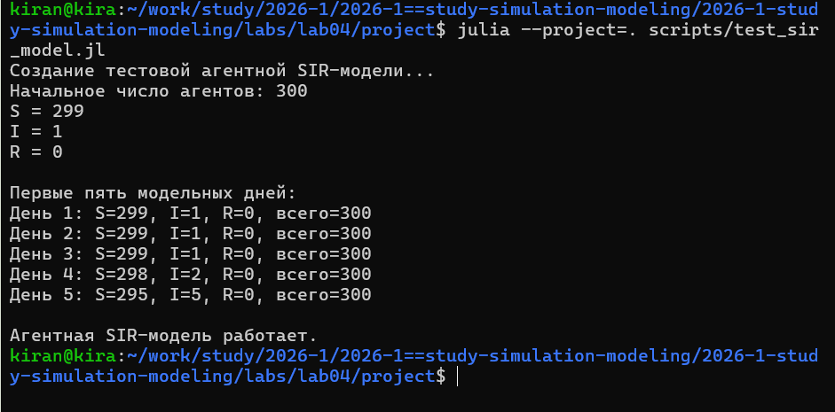
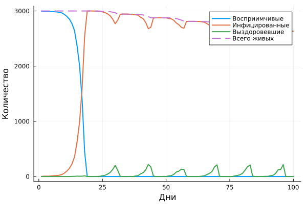
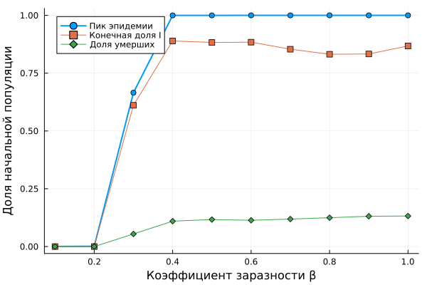
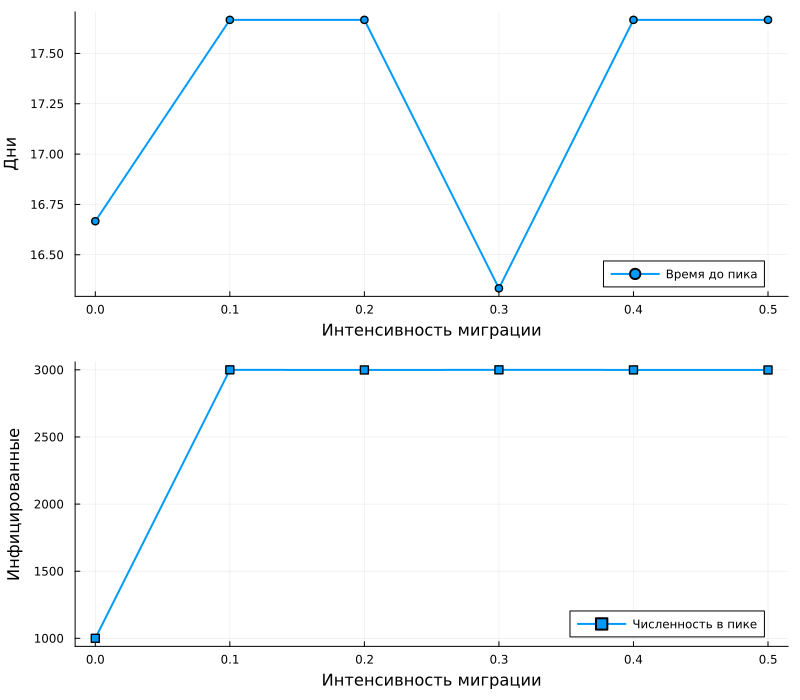
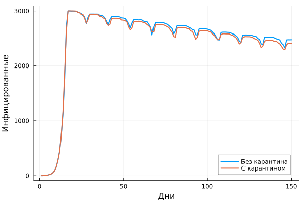
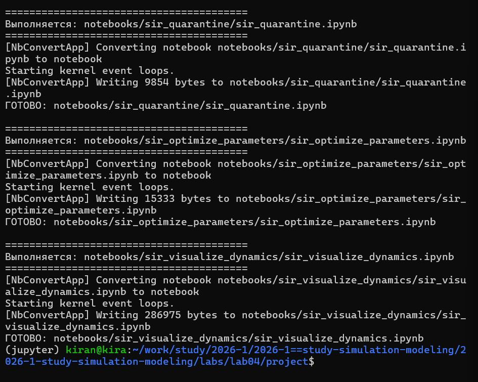

## Цель работы

**Цель:** реализовать модель SIR в агентном подходе
и исследовать влияние параметров на эпидемическую динамику.

В работе:

- каждый человек представлен отдельным агентом;
- агенты распределены между городами;
- учитываются миграция и случайное заражение;
- исследованы заразность и гетерогенность;
- добавлена карантинная мера;
- выполнена оптимизация параметров.

## Агентная модель SIR

:::: {.columns align=center}

::: {.column width="39%"}

Каждый агент имеет состояние:

- `S` — восприимчивый;
- `I` — инфицированный;
- `R` — выздоровевший.

Дополнительно хранится количество дней после заражения.

Города представлены вершинами графа,
между которыми агенты могут перемещаться.

:::

::: {.column width="61%"}

{width=100%}

:::

::::

## Базовый эксперимент

:::: {.columns align=center}

::: {.column width="31%"}

В базовом сценарии:

- 3 города;
- по 1000 агентов;
- один начальный инфицированный;
- 100 модельных дней.

Программа сама определяет:

- $R_0$;
- величину пика;
- день пика;
- число умерших.

:::

::: {.column width="69%"}

{width=100%}

:::

::::

## Влияние заразности

:::: {.columns align=center}

::: {.column width="30%"}

Коэффициент $\beta$ изменялся
от 0.1 до 1.0.

Для каждого значения выполнено
несколько прогонов с разными `seed`.

После усреднения определяется
порог возникновения эпидемии.

:::

::: {.column width="70%"}

{width=100%}

:::

::::

## Гетерогенность городов

:::: {.columns align=center}

::: {.column width="30%"}

Для городов были заданы разные значения:

$$
\beta_1=0.2,\quad
\beta_2=0.5,\quad
\beta_3=0.8.
$$

Это позволяет отказаться от предположения
об одинаковой эпидемической ситуации
во всех локациях.

:::

::: {.column width="70%"}

{width=88%}

:::

::::

## Влияние миграции

:::: {.columns align=center}

::: {.column width="31%"}

Интенсивность перемещений между городами
изменялась от 0 до 0.5.

Для каждого сценария рассчитывались:

- время до пика;
- величина пика.

Матрица миграции создаётся
программно для каждого эксперимента.

:::

::: {.column width="69%"}

{width=95%}

:::

::::

## Карантинная мера

:::: {.columns align=center}

::: {.column width="31%"}

При превышении порога заболеваемости
город автоматически закрывается для выезда.

Сравнивались два сценария:

- без ограничений;
- с карантином.

Оба сценария запускаются
с одинаковым `seed`.

:::

::: {.column width="69%"}

{width=100%}

:::

::::

## Оптимизация параметров

:::: {.columns align=center}

::: {.column width="42%"}

Автоматически подбирались:

- коэффициент заразности;
- время выявления;
- параметр смертности.

Цель — уменьшить смертность
при ограничении

$$
I_{\max} \leq 30\%.
$$

Превышение допустимого пика
штрафуется целевой функцией.

:::

::: {.column width="58%"}

{width=100%}

:::

::::

## Сводный анализ

:::: {.columns align=center}

::: {.column width="30%"}

Сводная визуализация строится
из уже рассчитанных данных.

На ней одновременно сравниваются:

- пиковая заболеваемость;
- конечная доля инфицированных;
- смертность;
- доля выздоровевших.

:::

::: {.column width="70%"}

{width=85%}

:::

::::

## Литературное программирование

:::: {.columns align=center}

::: {.column width="38%"}

Все основные эксперименты
оформлены в литературном стиле.

Из одного исходника автоматически создаются:

- Julia-скрипт;
- Quarto-документ;
- Jupyter Notebook.

:::

::: {.column width="62%"}

{width=100%}

:::

::::

## Проверка воспроизводимости

:::: {.columns align=center}

::: {.column width="37%"}

Все созданные Jupyter Notebook
были повторно выполнены.

Таким образом проверяется,
что эксперимент воспроизводится
из автоматически созданных файлов.

:::

::: {.column width="63%"}

{width=100%}

:::

::::

## Результаты разработки

:::: {.columns align=center}

::: {.column width="40%"}

В проекте сохранены:

- ядро SIR-модели;
- программы экспериментов;
- CSV и JLD2 с результатами;
- оригинальные PNG;
- Quarto-документация;
- Jupyter Notebook.

:::

::: {.column width="60%"}

{width=100%}

:::

::::

## Выводы

В лабораторной работе модель SIR реализована
на уровне отдельных агентов.

- исследован базовый эпидемический сценарий;
- найден порог по коэффициенту заразности;
- учтена неоднородность городов;
- исследовано влияние миграции;
- реализована карантинная мера;
- выполнена оптимизация параметров.

**Все вычислительные эксперименты оформлены
как воспроизводимый Julia-проект.**
