# Введение

Цель лабораторной работы — реализовать классическую эпидемиологическую
модель SIR в агентном подходе и исследовать влияние параметров
на распространение инфекции.

В отличие от модели на дифференциальных уравнениях,
здесь каждый человек моделируется как отдельный агент.
Агенты находятся в нескольких городах, могут перемещаться между ними,
заражаться, выздоравливать и выбывать из модели.

В ходе работы выполнены базовый эксперимент,
сканирование коэффициента заразности, исследование гетерогенности городов,
анализ миграции, моделирование карантинной меры
и оптимизация параметров.

# Подготовка рабочего окружения

Работа выполнялась в существующем репозитории курса
в ветке `develop`.

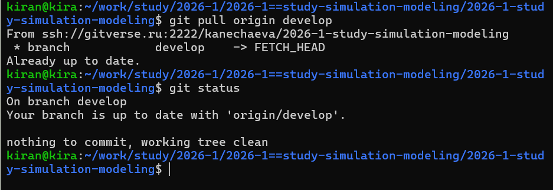{width=90%}

Для лабораторной работы использовалось отдельное окружение DrWatson.
Перед запуском экспериментов была проверена загрузка всех необходимых
библиотек.

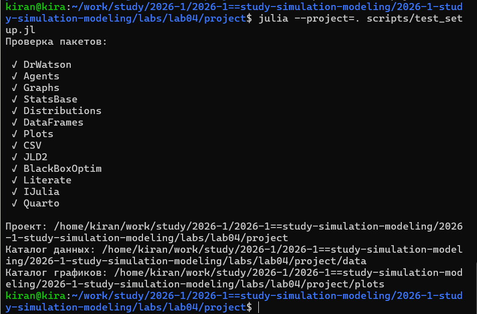{width=90%}

Основным инструментом агентного моделирования является пакет `Agents.jl`.
Для представления системы городов используется графовое пространство,
а случайное количество новых заражений моделируется с помощью
распределения Пуассона.

# Проверка агентной модели

Перед проведением основных экспериментов модель была проверена
на уменьшенной популяции.

{width=90%}

На тестовом запуске проверяется создание агентов,
их распределение по состояниям S, I и R
и выполнение последовательных модельных шагов.

# Базовый эксперимент

Базовая модель включает три города по 1000 агентов.
Начальная инфекция присутствует только у одного агента.

Для эксперимента программно вычисляется величина

$$
\gamma = \frac{1}{T},
$$

где $T$ — продолжительность инфекционного периода,
а затем определяется базовое репродуктивное число.

Также автоматически определяются эпидемический пик,
день его достижения и количество выбывших из-за смерти агентов.

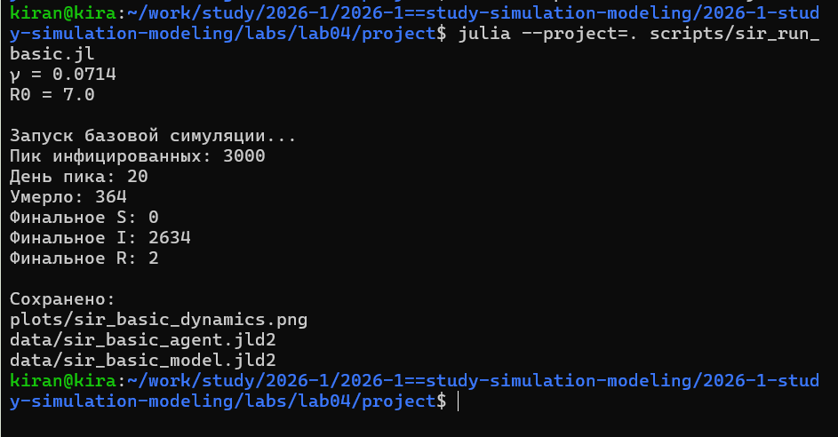{width=90%}

Полученная динамика представлена на графике.

{width=85%}

В начале эксперимента большинство населения относится к состоянию S.
После появления инфекции количество I увеличивается,
достигает максимума и затем сокращается по мере перехода
агентов в состояние R.

## Литературная версия базового эксперимента



# Исследование коэффициента заразности

Для анализа чувствительности модели коэффициент заразности
изменялся от 0.1 до 1.0.

Поскольку агентная модель является стохастической,
для каждого значения выполнялось три прогона
с различными значениями `seed`.

После этого показатели усреднялись.

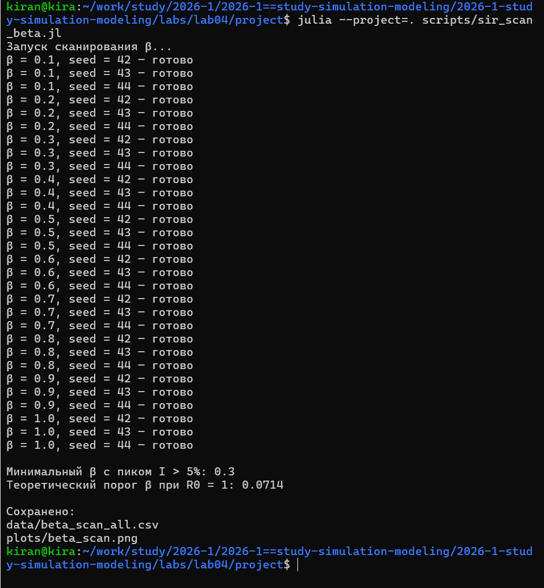{width=90%}

Программа автоматически определяет минимальное значение коэффициента,
при котором пиковая доля инфицированных превышает 5 процентов,
и сравнивает его с теоретическим порогом.

{width=85%}

Рост коэффициента заразности увеличивает эпидемическую нагрузку
и влияет на долю умерших.

## Литературная версия исследования



# Гетерогенность городов

В следующем эксперименте предположение об одинаковой заразности
во всех городах было снято.

Для трёх городов использовались различные значения коэффициента:

- первый город — 0.2;
- второй город — 0.5;
- третий город — 0.8.

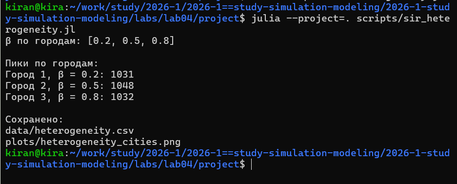{width=90%}

Динамика каждого города собиралась отдельно.

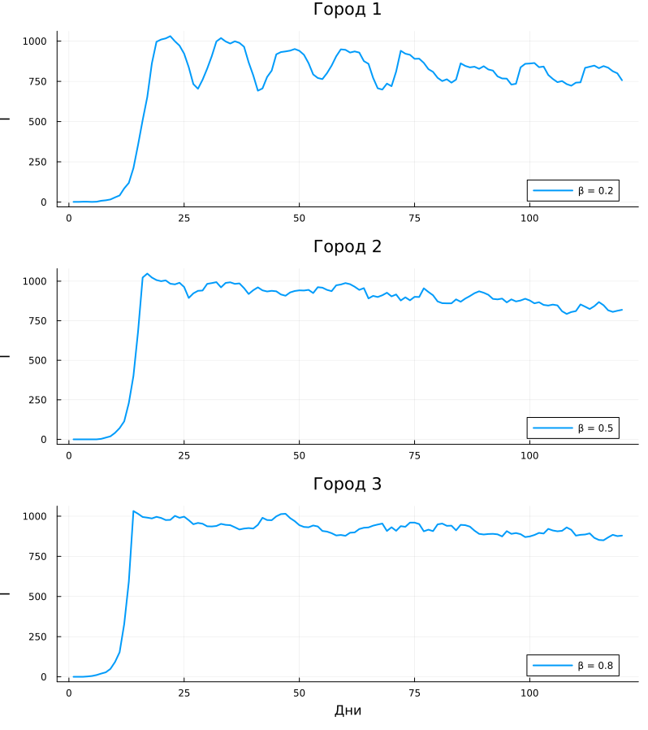{width=82%}

Такой эксперимент показывает, что локальные характеристики
отдельных частей системы могут существенно изменять
общую эпидемическую динамику.

## Литературная версия эксперимента



# Влияние миграции

В агентной модели агенты могут перемещаться между городами.

Для анализа этого эффекта интенсивность миграции
изменялась от 0 до 0.5.

Для каждого значения выполнялось несколько независимых прогонов,
после чего рассчитывались среднее время до эпидемического пика
и средняя величина пика.

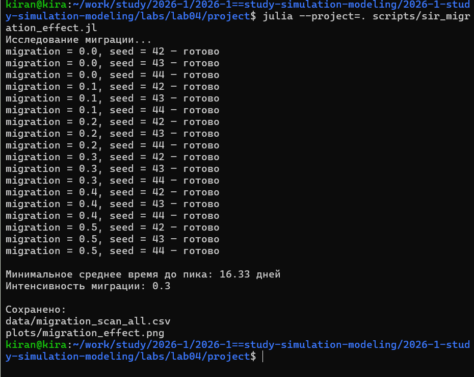{width=90%}

Полученные зависимости:

{width=85%}

Изменение мобильности населения влияет не только
на масштаб эпидемии, но и на скорость её распространения.

## Литературная версия эксперимента



# Карантинная мера

В модель была добавлена возможность автоматически закрывать город
при превышении заданного порога заболеваемости.

При достижении долей инфицированных 10 процентов
миграция из соответствующего города блокируется.

Для корректного сравнения сценарии с карантином и без карантина
запускаются с одинаковым `seed`.

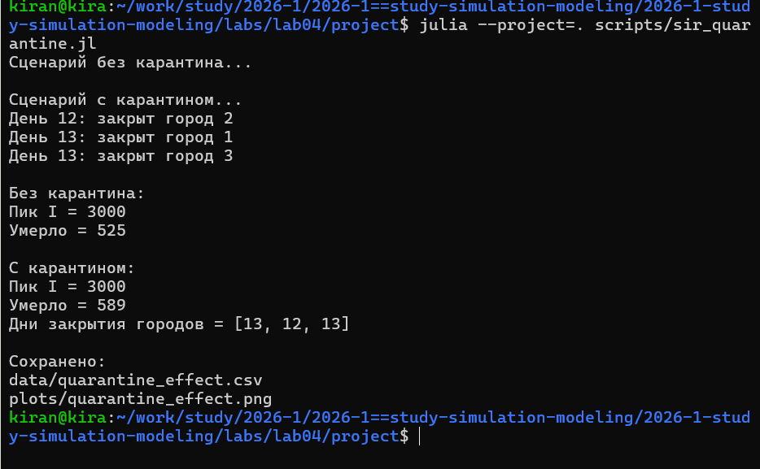{width=90%}

На графике сравниваются два сценария.

{width=85%}

Такое сравнение позволяет оценить влияние ограничения мобильности
на эпидемический пик.

## Литературная версия эксперимента



# Оптимизация параметров

Для поиска допустимой стратегии управления
была выполнена автоматическая оптимизация параметров модели.

Оптимизатор изменяет:

- коэффициент заразности;
- время выявления заболевания;
- параметр смертности.

Целевая функция минимизирует смертность,
при этом превышение пикового уровня инфицированных
в 30 процентов штрафуется.

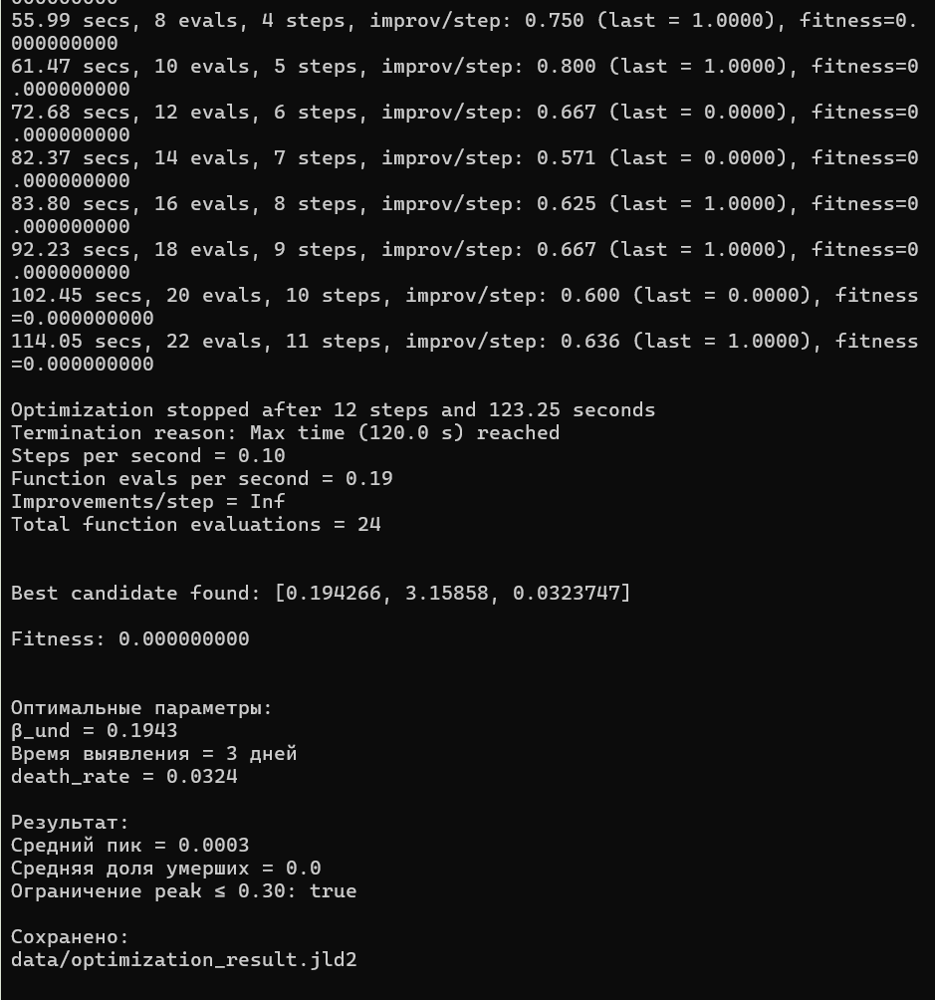{width=90%}

После завершения оптимизации программа повторно оценивает
найденный набор параметров на нескольких независимых прогонах.

## Литературная версия оптимизации



# Сводная визуализация

Для итогового анализа использовались ранее сохранённые результаты
сканирования коэффициента заразности.

Повторный запуск всех симуляций для этого этапа не требуется.

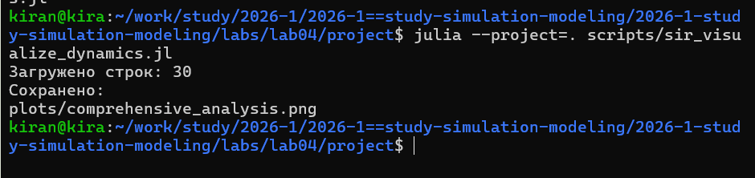{width=90%}

Итоговая фигура объединяет информацию о пике инфекции,
смертности и доле выздоровевших.

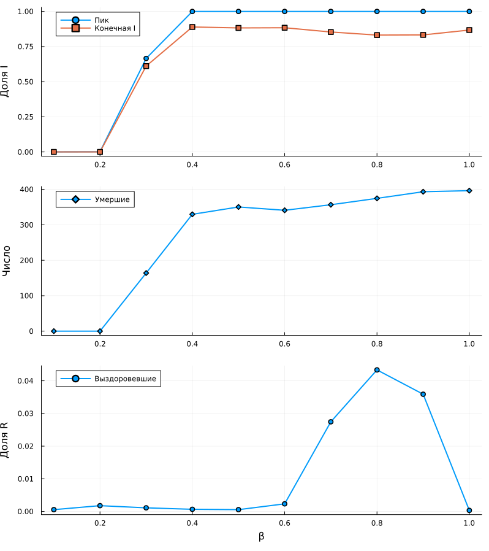{width=82%}

## Литературная версия визуализации



# Генерация производных форматов

Все основные программы были оформлены в литературном стиле.

Для каждой из них автоматически сформированы:

- чистый Julia-код;
- документ Quarto;
- Jupyter Notebook.

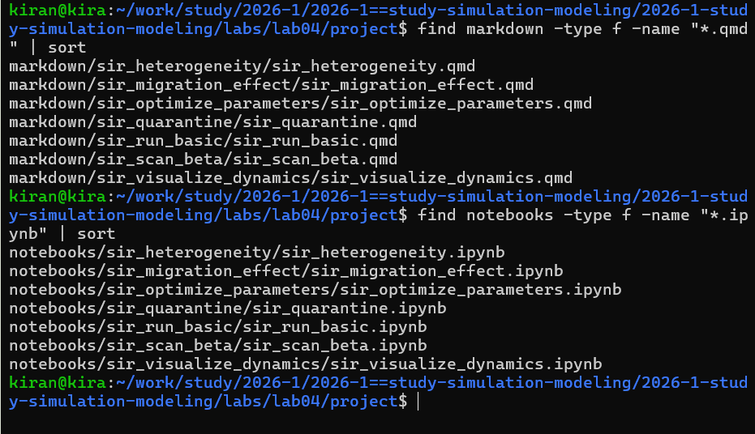{width=90%}

# Проверка воспроизводимости

Сгенерированные Jupyter Notebook были повторно выполнены.

{width=90%}

Таким образом была проверена воспроизводимость вычислительных
экспериментов из автоматически созданных notebooks.

# Итоговая структура проекта

После выполнения лабораторной работы в проекте сохранены:

- ядро агентной модели;
- литературные исходники;
- чистые Julia-скрипты;
- Quarto-документация;
- Jupyter Notebook;
- CSV и JLD2-файлы с результатами;
- оригинальные PNG-графики.

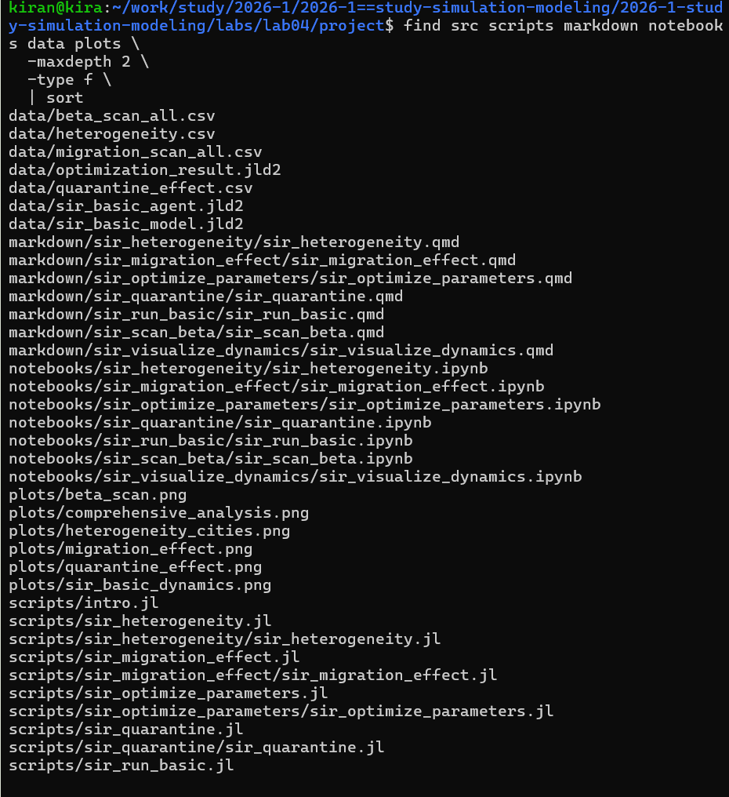{width=90%}

Все результаты были зафиксированы в системе контроля версий.

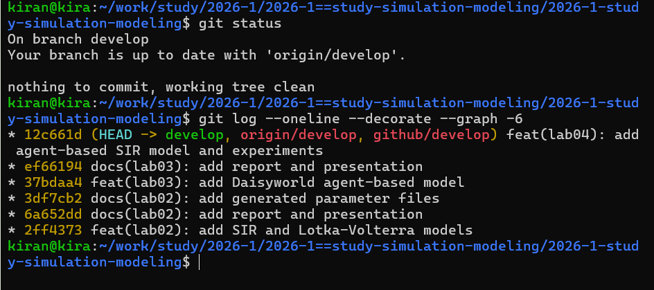{width=90%}

# Заключение

В лабораторной работе классическая модель SIR была реализована
в агентном подходе.

Каждый индивид моделировался отдельно,
а пространство было представлено системой взаимосвязанных городов.

Были исследованы базовая динамика эпидемии,
влияние коэффициента заразности,
гетерогенность городов и интенсивность миграции.

Дополнительно в модель была добавлена карантинная мера
и выполнена автоматическая оптимизация параметров.

Все основные вычисления выполнялись программно,
а исходники были оформлены в литературном стиле
с автоматическим формированием Julia, Quarto и Jupyter Notebook.
