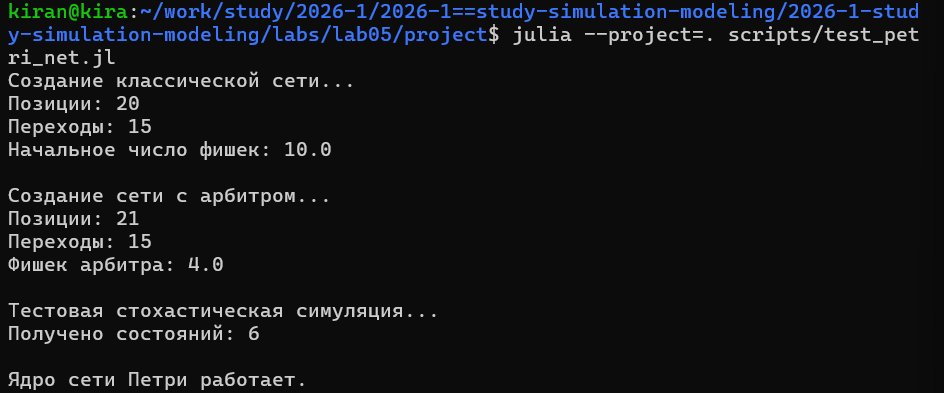
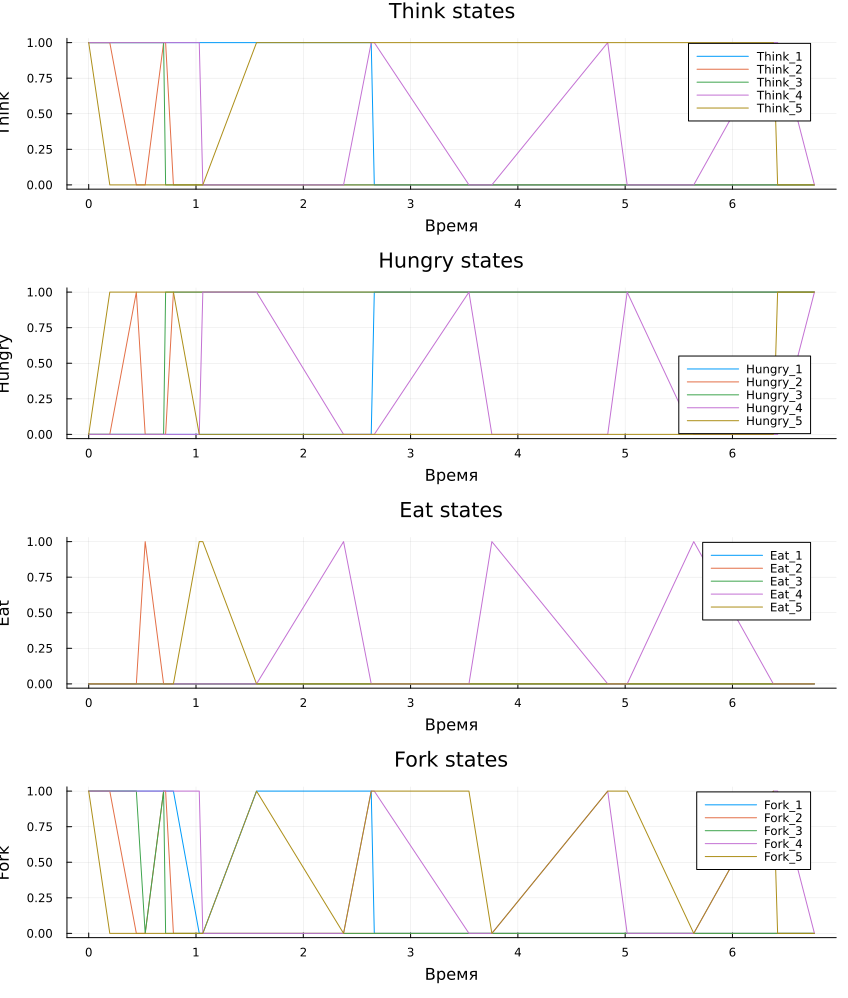
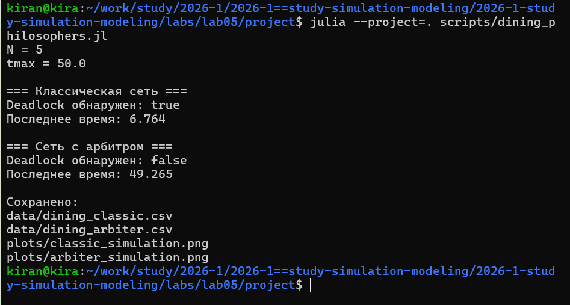
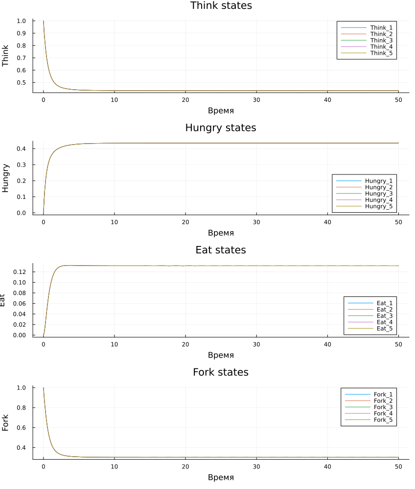
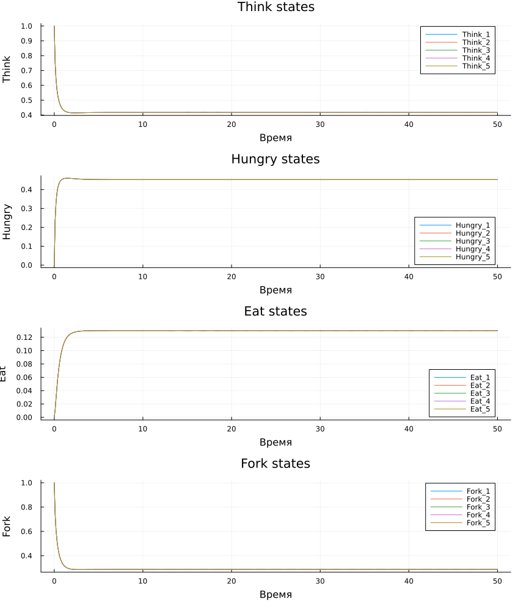

## Цель работы

- Реализовать задачу «Обедающие философы» с помощью сети Петри.
- Исследовать возникновение взаимной блокировки.
- Сравнить классическую сеть и сеть с арбитром.
- Выполнить стохастическое и детерминированное моделирование.
- Исследовать влияние параметров модели.
- Проверить воспроизводимость вычислений.

---

## Сеть Петри

:::: {.columns}

::: {.column width="43%"}

У каждого философа есть состояния:

- `Think`;
- `Hungry`;
- `Eat`.

Вилки представлены отдельными позициями сети.

Переходы соответствуют захвату и освобождению ресурсов.

:::

::: {.column width="57%"}

{width=100%}

:::

::::

---

## Почему возникает deadlock

В классической постановке каждый философ сначала может получить одну вилку.

Если все философы одновременно удерживают по одной вилке:

- соседняя вилка уже занята;
- перейти в состояние `Eat` невозможно;
- ни один необходимый переход не может сработать;
- сеть оказывается во взаимной блокировке.

---

## Сеть с арбитром

В модифицированную сеть добавлена дополнительная позиция `Arbiter`.

В ней находится `N - 1` фишек.

Это ограничивает число философов, которые могут одновременно начать захват ресурсов, и разрушает условие возникновения общего тупика.

---

## Стохастическая модель

:::: {.columns}

::: {.column width="50%"}

{width=100%}

:::

::: {.column width="50%"}

{width=100%}

:::

::::

Моделирование выполнено алгоритмом Гиллеспи.

---

## Программная проверка deadlock

:::: {.columns}

::: {.column width="45%"}

После симуляции программа проверяет последнюю маркировку.

Если ни один переход больше не разрешён, состояние определяется как `deadlock`.

Для сравнения две модели запускаются с одинаковым `seed`.

:::

::: {.column width="55%"}

{width=100%}

:::

::::

---

## Детерминированное моделирование

:::: {.columns}

::: {.column width="50%"}

{width=100%}

:::

::: {.column width="50%"}

{width=100%}

:::

::::

Матрица инцидентности используется для построения системы ОДУ.

Поэтому вместо отдельных случайных событий получается непрерывная траектория состояний.

---

## Сравнение двух вариантов сети

{width=88%}

Для этого графика повторная симуляция не требуется.

Он строится из ранее сохранённых CSV-файлов и показывает, продолжают ли философы переходить в состояние `Eat`.

---

## Параметрическое исследование

:::: {.columns}

::: {.column width="42%"}

Проверены:

- `N = 3`;
- `N = 5`;
- `N = 7`;
- несколько различных `seed`.

Для каждой комбинации рассчитывалось наличие `deadlock`.

:::

::: {.column width="58%"}

{width=100%}

:::

::::

---

## Почему используются несколько seed

Алгоритм Гиллеспи является стохастическим.

Поэтому один запуск не даёт полной картины.

Повторные эксперименты позволяют рассчитать долю запусков с взаимной блокировкой и оценить устойчивость результата.

---

## Литературное программирование

:::: {.columns}

::: {.column width="43%"}

Из литературного исходника автоматически создаются:

- Julia-код;
- Jupyter Notebook;
- Quarto-документация.

Таким образом код и его описание хранятся в одном источнике.

:::

::: {.column width="57%"}

{width=100%}

:::

::::

---

## Проверка воспроизводимости

:::: {.columns}

::: {.column width="43%"}

Все созданные Jupyter Notebook были отдельно выполнены.

Это проверяет возможность повторно получить результаты без ручного изменения notebook.

:::

::: {.column width="57%"}

{width=100%}

:::

::::

---

## Структура проекта

:::: {.columns}

::: {.column width="43%"}

В проекте сохранены:

- модуль сети Петри;
- литературные программы;
- Julia-файлы;
- Jupyter Notebook;
- Quarto-документация;
- CSV;
- PNG;
- GIF.

:::

::: {.column width="57%"}

{width=100%}

:::

::::

---

## Выводы

- Сети Петри позволяют моделировать конкуренцию процессов за ограниченные ресурсы.
- Классическая задача обедающих философов допускает взаимную блокировку.
- Добавление арбитра меняет правило доступа к ресурсам и предотвращает общий тупик.
- Алгоритм Гиллеспи показывает стохастическую динамику сети.
- Детерминированная модель даёт непрерывное представление тех же процессов.
- Повторные эксперименты позволяют исследовать устойчивость результатов.
- Литературное программирование обеспечивает воспроизводимость вычислений.
