# Цель работы

Цель лабораторной работы — изучить применение сетей Петри для моделирования дискретных систем на примере задачи «Обедающие философы».

В работе реализованы классическая сеть Петри и модифицированная сеть с арбитром. Для них проведены стохастическое и детерминированное моделирование, выполнена программная проверка возникновения взаимной блокировки, создана анимация и проведено параметрическое исследование.

# Подготовка рабочего окружения

Работа выполнялась в Ubuntu через WSL. Проект размещён в общем репозитории лабораторных работ и ведётся в ветке `develop`.

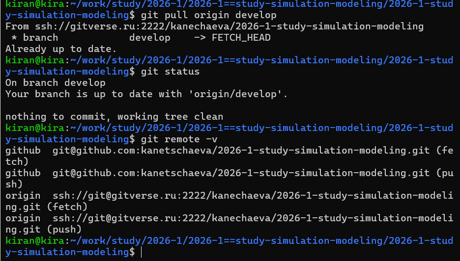{fig-align="center" width=95%}

Для лабораторной работы было создано отдельное окружение Julia и установлены библиотеки для численного моделирования, обработки данных, визуализации, литературного программирования и работы с Jupyter Notebook.

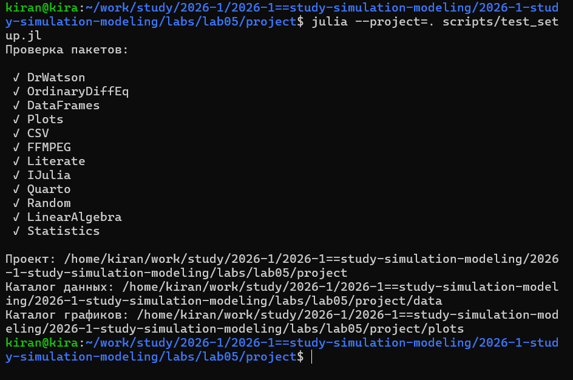{fig-align="center" width=95%}

# Реализация сети Петри

Для представления сети была реализована структура `PetriNet`, которая хранит количество позиций, переходов, матрицу инцидентности и имена элементов.

Для пяти философов классическая сеть содержит 20 позиций и 15 переходов.

В модели с арбитром появляется дополнительная позиция. В ней изначально находится `N - 1` фишек, поэтому все философы не могут одновременно начать захват ресурсов.

Перед основными экспериментами была проведена отдельная проверка построения обеих сетей и короткий тест стохастического моделирования.

{fig-align="center" width=95%}

# Стохастическое моделирование

Для стохастической модели использован алгоритм Гиллеспи.

Состояние сети меняется отдельными срабатываниями переходов. Выбор следующего перехода и времени его срабатывания зависит от текущего состояния сети.

Классическая сеть и сеть с арбитром запускались с одинаковым значением `seed`. Это позволяет сравнивать модели при одинаковой последовательности псевдослучайных чисел.

После симуляции программа автоматически проверяет доступность переходов. Если ни один переход больше не может сработать, фиксируется `deadlock`.

{fig-align="center" width=95%}

{fig-align="center" width=90%}

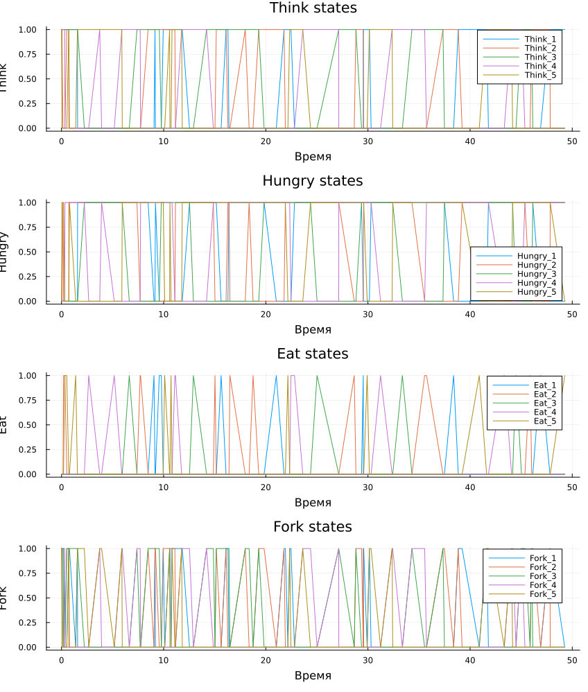{fig-align="center" width=90%}

# Детерминированное моделирование

Дополнительно была исследована детерминированная версия модели.

Матрица инцидентности сети используется для формирования системы дифференциальных уравнений. Поэтому здесь получается непрерывная траектория изменения состояний вместо последовательности отдельных случайных событий.

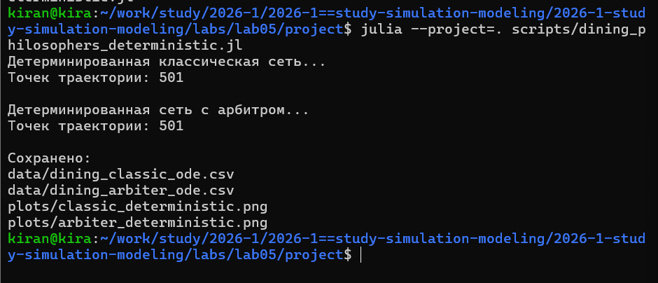{fig-align="center" width=95%}

{fig-align="center" width=90%}

{fig-align="center" width=90%}

# Анимация работы сети

Для дополнительной визуализации была создана GIF-анимация.

В анимации использованы три философа. Такое уменьшение количества участников позволяет лучше видеть отдельные позиции и изменение количества фишек.

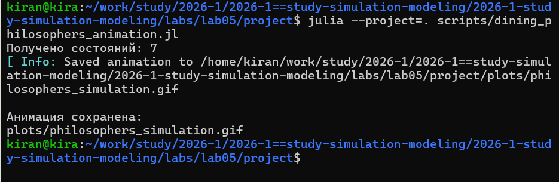{fig-align="center" width=95%}

Анимация сохранена в файле:

`image/plots/philosophers_simulation.gif`.

# Итоговое сравнение

Для итогового сравнения используются ранее сохранённые результаты моделирования.

Скрипт загружает CSV-файлы и анализирует состояния `Eat_i` для всех философов. Повторная симуляция при этом не выполняется.

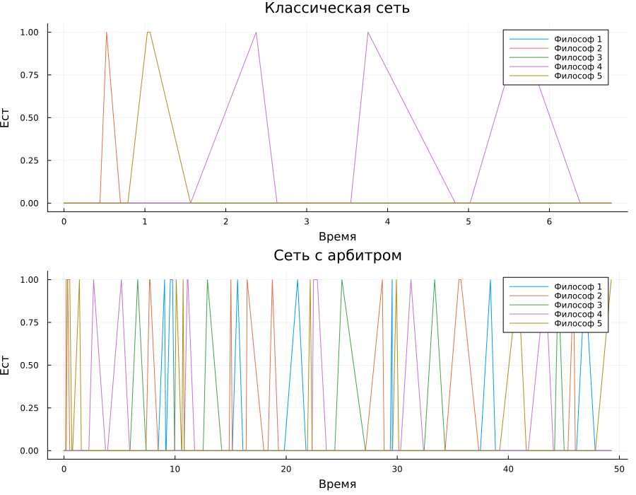{fig-align="center" width=90%}

В классической модели длительное отсутствие философов в состоянии `Eat` соответствует взаимной блокировке. В сети с арбитром доступ к ресурсам сохраняется.

# Параметрическое исследование

Стохастическая модель может давать разные траектории при разных последовательностях случайных чисел.

Поэтому дополнительное исследование проводилось для нескольких параметров:

- `N = 3`;
- `N = 5`;
- `N = 7`;
- нескольких значений `seed`.

Для каждой комбинации параметров отдельно моделировалась классическая сеть и сеть с арбитром.

После этого программа рассчитывала долю запусков, завершившихся взаимной блокировкой.

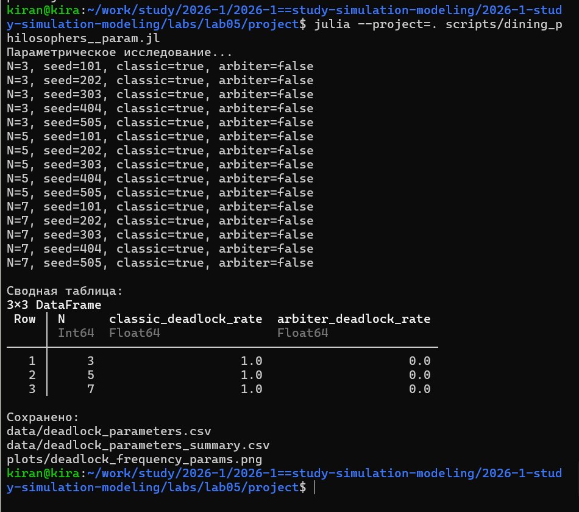{fig-align="center" width=95%}

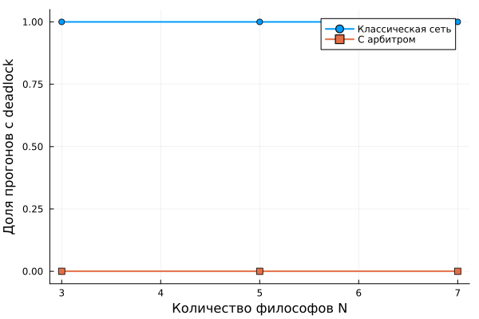{fig-align="center" width=90%}

Использование нескольких повторных запусков позволяет оценивать не отдельную случайную траекторию, а устойчивость результата.

# Литературное программирование

Основные вычислительные сценарии были оформлены в литературном стиле.

Из одного исходного файла автоматически создаются:

- чистый Julia-код;
- Jupyter Notebook;
- документация Quarto.

Это позволяет поддерживать код и пояснение в одном исходнике.

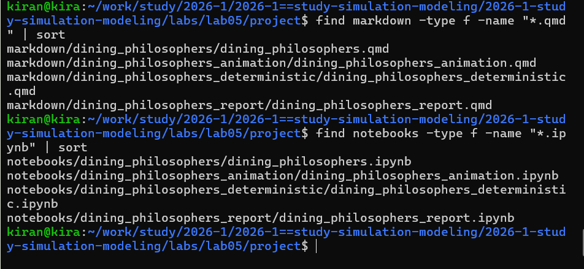{fig-align="center" width=95%}

# Проверка воспроизводимости

Автоматически созданные Jupyter Notebook были отдельно выполнены.

Это проверяет, что сгенерированные notebooks содержат все необходимые команды и могут самостоятельно воспроизвести вычислительные эксперименты.

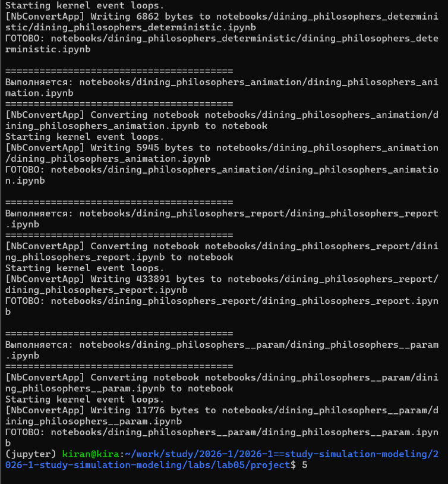{fig-align="center" width=95%}

# Структура проекта

После выполнения работы проект содержит исходный модуль сети Петри, литературные программы, сгенерированные версии программ, notebooks, документацию, таблицы, графики и анимацию.

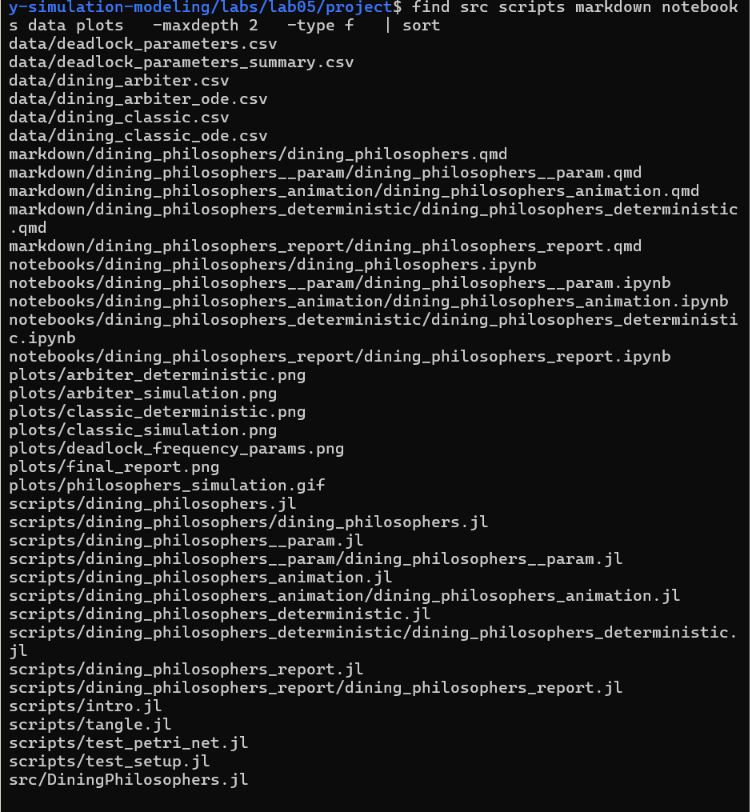{fig-align="center" width=95%}

# Контроль версий

Все изменения были сохранены в Git и отправлены в удалённые репозитории.

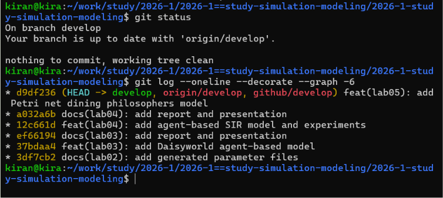{fig-align="center" width=95%}

# Выводы

В лабораторной работе была реализована задача «Обедающие философы» с использованием аппарата сетей Петри.

Были построены классическая сеть и сеть с дополнительным арбитром. Для обеих моделей выполнено стохастическое и детерминированное моделирование.

Программная проверка состояния сети позволяет автоматически обнаруживать взаимную блокировку. Добавление арбитра изменяет правило распределения ресурсов и предотвращает ситуацию, когда все философы одновременно удерживают только одну вилку и ожидают вторую.

Дополнительно было проведено параметрическое исследование для различного числа философов и нескольких случайных траекторий.

Все основные вычисления оформлены в литературном стиле, а автоматически созданные Jupyter Notebook отдельно выполнены для проверки воспроизводимости.

# Приложение А. Quarto-документация основного эксперимента {.unnumbered}

Ниже интегрирована статическая версия документации Quarto, автоматически созданной из литературного исходного кода.



# Приложение Б. Quarto-документация параметрического исследования {.unnumbered}

Ниже интегрирована документация параметрической версии программы.


