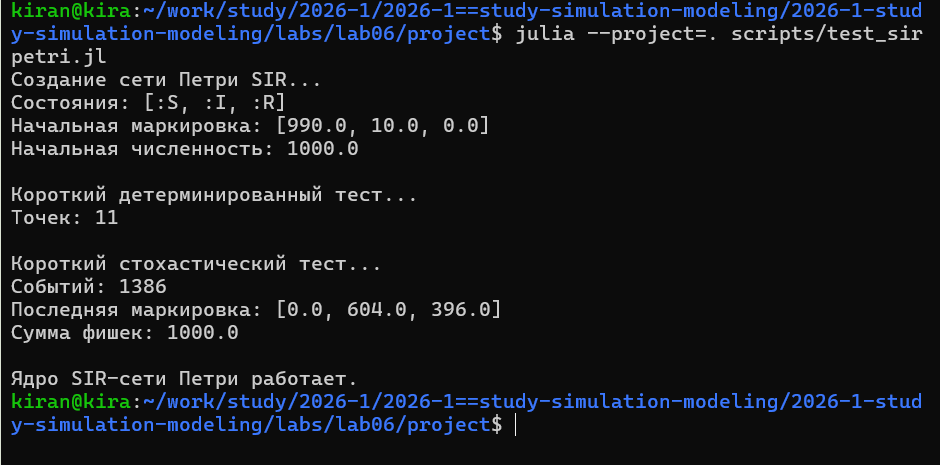
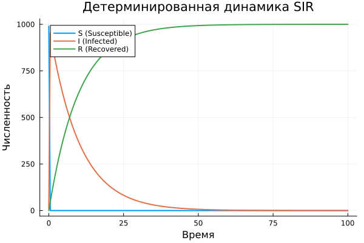
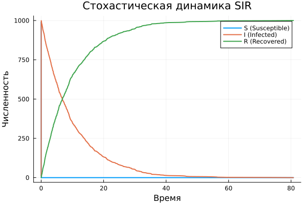
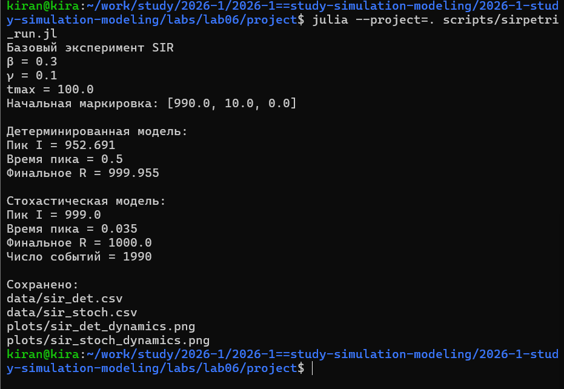
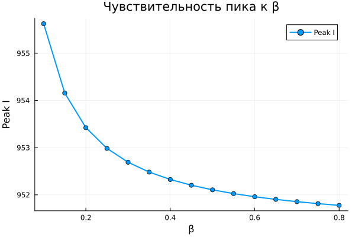
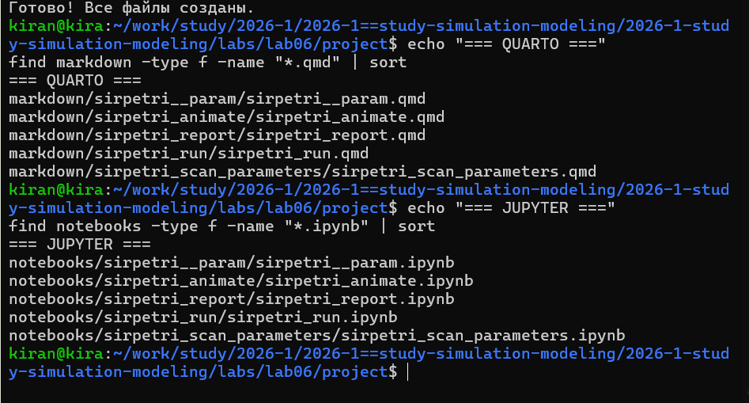
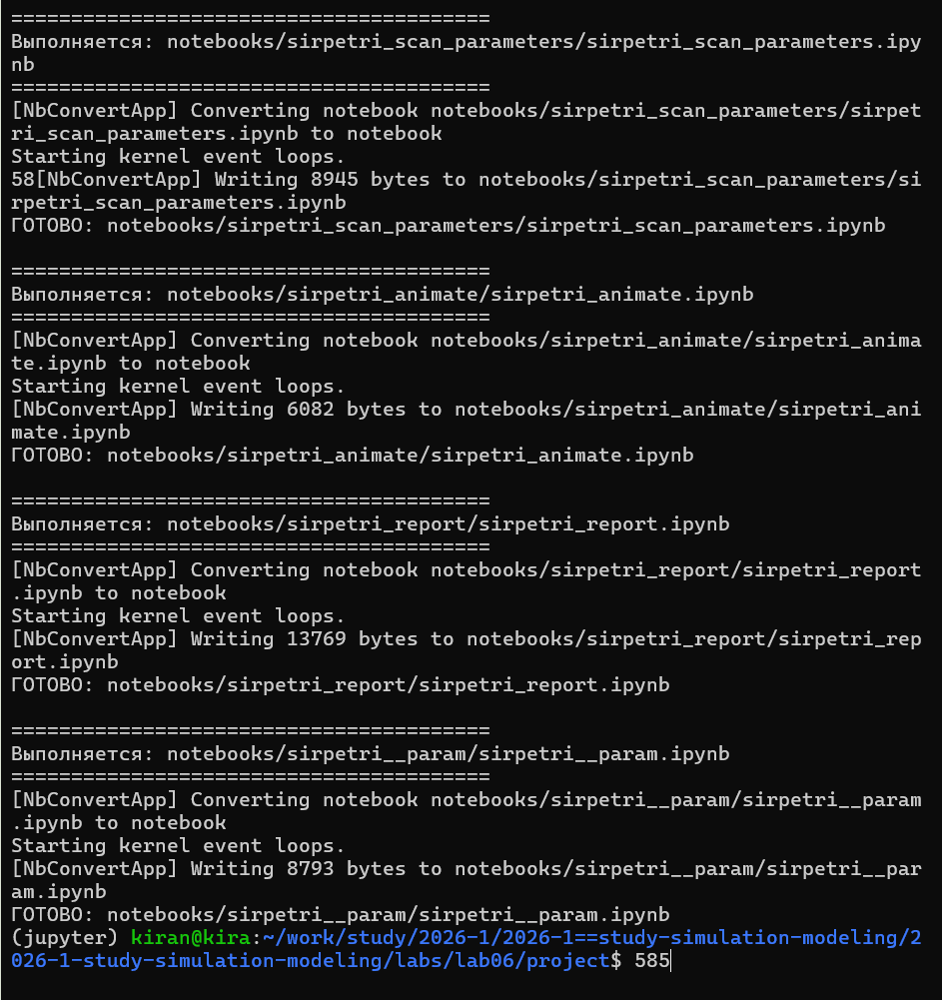
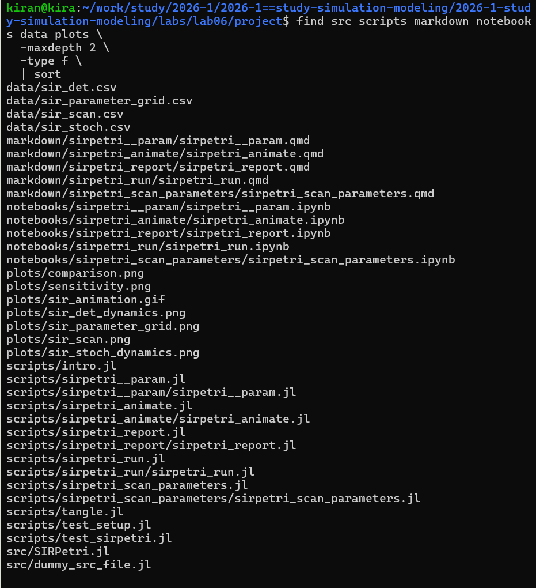

## Цель работы

- Представить SIR как сеть Петри.
- Реализовать детерминированное моделирование.
- Реализовать стохастическую модель по алгоритму Гиллеспи.
- Исследовать влияние коэффициента заражения.
- Провести параметрическое исследование.
- Проверить воспроизводимость вычислений.

---

## SIR как сеть Петри

:::: {.columns}

::: {.column width="45%"}

Состояния:

- `S` — восприимчивые;
- `I` — инфицированные;
- `R` — выздоровевшие.

Переходы:

- `infection`;
- `recovery`.

Начальная маркировка:

`[990, 10, 0]`.

:::

::: {.column width="55%"}

{width=100%}

:::

::::

---

## Два способа моделирования

В работе одна и та же сеть исследуется двумя способами.

**Детерминированная модель**

- система ОДУ;
- непрерывная траектория;
- метод `Tsit5`.

**Стохастическая модель**

- алгоритм Гиллеспи;
- отдельные случайные события;
- случайное время между событиями.

---

## Базовый эксперимент

:::: {.columns}

::: {.column width="50%"}

{width=100%}

:::

::: {.column width="50%"}

{width=100%}

:::

::::

Параметры:

`β = 0.3`, `γ = 0.1`, `tmax = 100`.

---

## Автоматический анализ траекторий

:::: {.columns}

::: {.column width="43%"}

Для обеих моделей программа самостоятельно определяет:

- пик инфицированных;
- время пика;
- итоговое число выздоровевших.

Это позволяет сравнивать результаты численно, а не только визуально.

:::

::: {.column width="57%"}

{width=100%}

:::

::::

---

## Влияние коэффициента β

:::: {.columns}

::: {.column width="40%"}

Исследуется диапазон:

`β = 0.1 : 0.05 : 0.8`.

При этом:

`γ = 0.1`.

Для каждого β выполняется отдельная симуляция.

:::

::: {.column width="60%"}

{width=100%}

:::

::::

---

## Сравнение двух подходов

{width=88%}

Итоговый график строится из сохранённых CSV-файлов.

Для анализа повторная симуляция не выполняется.

---

## Чувствительность пика

{width=82%}

По серии экспериментов можно оценить, как изменение скорости заражения влияет на максимальную нагрузку эпидемии.

---

## Параметрическое исследование

:::: {.columns}

::: {.column width="42%"}

Одновременно изменяются:

`β = 0.1, 0.3, 0.5, 0.8`;

`γ = 0.05, 0.10, 0.20`.

Всего:

`4 × 3 = 12`

вариантов модели.

:::

::: {.column width="58%"}

{width=100%}

:::

::::

---

## Зачем менять два параметра

Изменение только `β` показывает влияние заразности.

Добавление разных значений `γ` позволяет увидеть, как результат зависит одновременно от:

- скорости появления новых заражений;
- скорости выхода людей из инфекционного состояния.

Таким образом исследуется уже комбинация механизмов модели.

---

## Литературное программирование

:::: {.columns}

::: {.column width="43%"}

Из литературного исходника автоматически создаются:

- Julia-код;
- Jupyter Notebook;
- Quarto-документация.

Код и пояснение поддерживаются в одном источнике.

:::

::: {.column width="57%"}

{width=100%}

:::

::::

---

## Проверка воспроизводимости

:::: {.columns}

::: {.column width="43%"}

Все автоматически созданные Jupyter Notebook были выполнены отдельно.

Это проверяет, что эксперимент можно повторить без ручного исправления notebooks.

:::

::: {.column width="57%"}

{width=100%}

:::

::::

---

## Структура проекта

:::: {.columns}

::: {.column width="43%"}

В проекте сохранены:

- модуль SIR;
- литературные программы;
- Julia-код;
- notebooks;
- Quarto-документы;
- CSV;
- PNG;
- GIF.

:::

::: {.column width="57%"}

{width=100%}

:::

::::

---

## Выводы

- Модель SIR представлена средствами сетей Петри.
- Детерминированный подход даёт непрерывную усреднённую динамику.
- Алгоритм Гиллеспи моделирует отдельные случайные события.
- Серия экспериментов позволяет исследовать чувствительность модели к `β`.
- Сетка `β × γ` позволяет оценить совместное влияние заражения и выздоровления.
- Сохранение промежуточных CSV отделяет моделирование от анализа.
- Литературное программирование и notebooks обеспечивают воспроизводимость.
