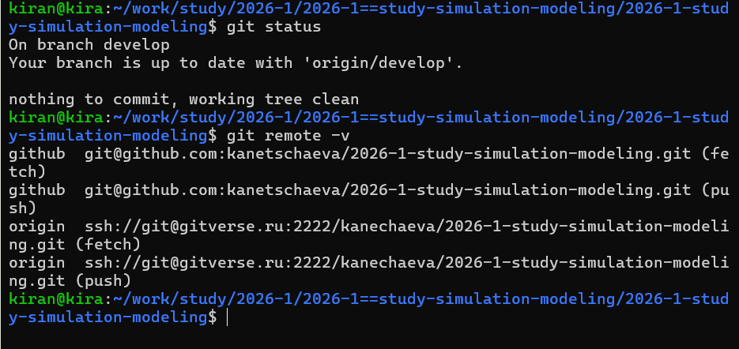
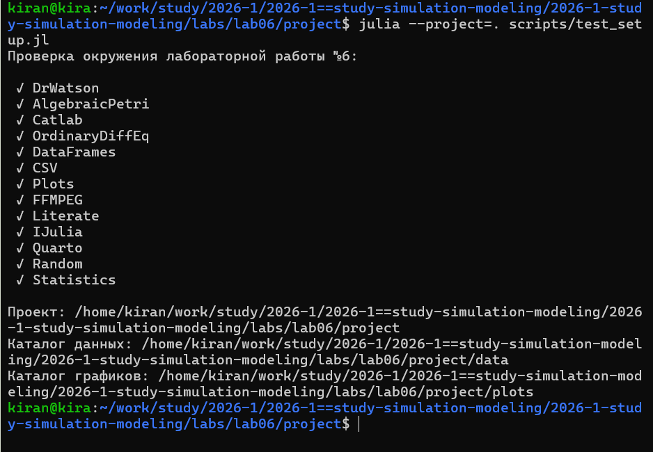
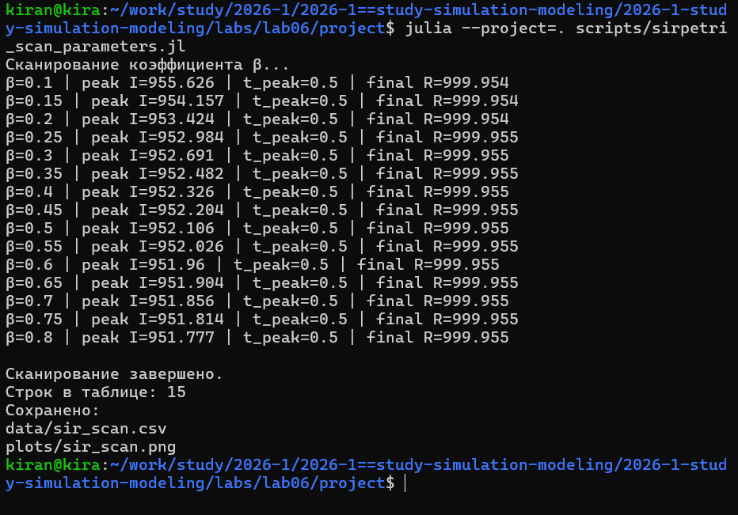
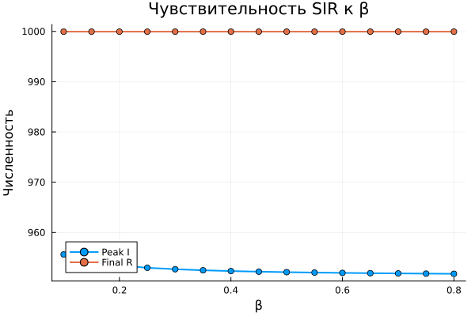
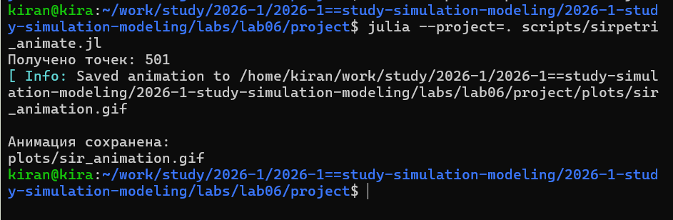
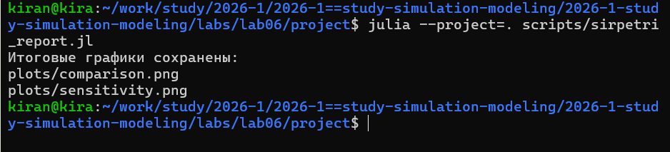
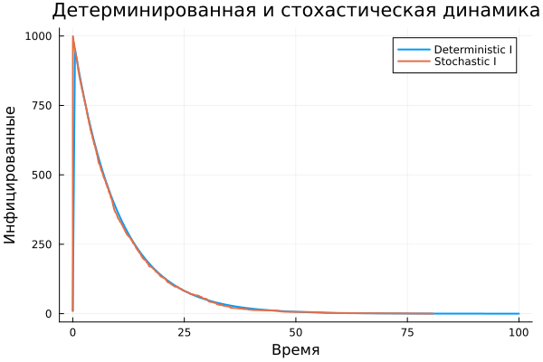
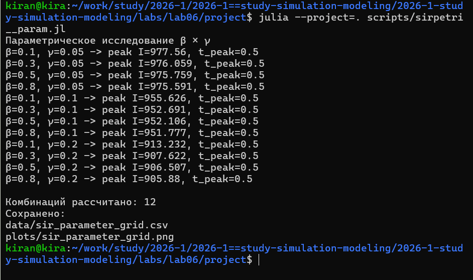
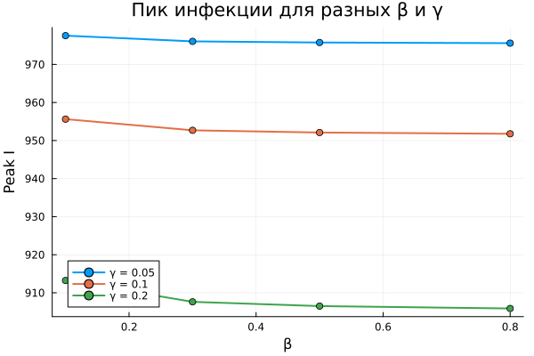
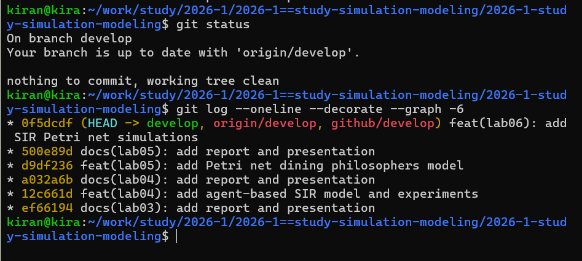

# Цель работы

Цель лабораторной работы — реализовать эпидемиологическую модель SIR средствами сетей Петри и исследовать её поведение при детерминированном и стохастическом моделировании.

В модели используются три состояния: восприимчивые `S`, инфицированные `I` и выздоровевшие `R`. Переход `infection` моделирует заражение, а переход `recovery` — выздоровление.

Дополнительно исследуется влияние коэффициента заражения, строится анимация динамики модели и проводится расчёт для набора параметров.

# Подготовка рабочего окружения

Работа выполнялась в Ubuntu через WSL. Проект расположен в общем репозитории лабораторных работ и ведётся в ветке `develop`.

{fig-align="center" width=95%}

Для работы были установлены библиотеки `AlgebraicPetri`, `Catlab`, `OrdinaryDiffEq`, `DataFrames`, `Plots`, `CSV`, а также средства литературного программирования и Jupyter Notebook.

{fig-align="center" width=95%}

# Реализация сети Петри SIR

Для модели определены три состояния:

- `S` — восприимчивые;
- `I` — инфицированные;
- `R` — выздоровевшие.

Используются два перехода:

- `infection`: заражение восприимчивого при взаимодействии с инфицированным;
- `recovery`: переход инфицированного в состояние выздоровления.

Начальная маркировка задаётся как:

`S = 990`, `I = 10`, `R = 0`.

Перед основными экспериментами была выполнена отдельная проверка построения сети, детерминированной и стохастической функций.

{fig-align="center" width=95%}

В стохастической версии дополнительно контролируется сохранение общей численности населения.

# Базовый эксперимент

Для базового эксперимента использовались параметры:

- `β = 0.3`;
- `γ = 0.1`;
- `tmax = 100`;
- `seed = 123`.

Для одной и той же сети выполняются два вида моделирования.

Детерминированный вариант решает систему обыкновенных дифференциальных уравнений и даёт непрерывную усреднённую динамику.

Стохастический вариант использует прямой алгоритм Гиллеспи, в котором каждое заражение или выздоровление является отдельным случайным событием.

{fig-align="center" width=95%}

Для обеих траекторий программа автоматически определяет величину пика инфицированных и время достижения максимума.

{fig-align="center" width=90%}

{fig-align="center" width=90%}

# Исследование коэффициента заражения

Для анализа чувствительности модели коэффициент выздоровления фиксировался:

`γ = 0.1`.

Коэффициент заражения изменялся в диапазоне:

`β = 0.1 : 0.05 : 0.8`.

Для каждого значения выполнялась самостоятельная детерминированная симуляция.

Программно рассчитывались:

- максимальное число инфицированных;
- время пика;
- итоговое число выздоровевших.

{fig-align="center" width=95%}

Всего было рассчитано 15 вариантов модели.

{fig-align="center" width=90%}

# Анимация динамики

Для динамической визуализации была создана GIF-анимация изменения состояний `S`, `I` и `R`.

Сначала детерминированная траектория рассчитывалась с небольшим шагом сохранения. Затем для анимации использовалась часть рассчитанных точек, что позволяет уменьшить размер GIF без повторного вычисления модели.

{fig-align="center" width=95%}

Файл сохранён как:

`image/plots/sir_animation.gif`.

# Итоговый сравнительный анализ

Итоговый анализ выполнялся на основе уже сохранённых CSV-файлов.

Повторный запуск модели здесь не требуется.

Используются:

- `sir_det.csv`;
- `sir_stoch.csv`;
- `sir_scan.csv`.

Сначала сравнивается динамика инфицированных в детерминированной и стохастической моделях.

Затем отдельно строится зависимость максимального числа инфицированных от коэффициента заражения.

{fig-align="center" width=95%}

{fig-align="center" width=90%}

{fig-align="center" width=90%}

# Параметрическое исследование

В дополнительной версии программы исследуется совместное влияние двух параметров модели:

- коэффициента заражения `β`;
- коэффициента выздоровления `γ`.

Использовались значения:

`β = 0.1, 0.3, 0.5, 0.8`;

`γ = 0.05, 0.10, 0.20`.

Всего получается 12 комбинаций.

Для каждой комбинации программа самостоятельно выполняет моделирование и рассчитывает:

- пик инфицированных;
- время пика;
- итоговое число выздоровевших.

{fig-align="center" width=95%}

{fig-align="center" width=90%}

Такой эксперимент позволяет исследовать совместное влияние скорости заражения и скорости выздоровления, а не только изменение одного параметра.

# Литературное программирование

Основные вычислительные сценарии были оформлены в литературном стиле.

Из каждого исходника автоматически создавались:

- чистый Julia-код;
- Jupyter Notebook;
- документация Quarto.

{fig-align="center" width=95%}

# Проверка воспроизводимости

После генерации все Jupyter Notebook были отдельно выполнены.

Таким образом проверяется, что автоматически созданные notebooks содержат все необходимые действия и способны самостоятельно повторить вычислительные эксперименты.

{fig-align="center" width=95%}

# Структура проекта

После выполнения лабораторной работы проект содержит:

- модуль `SIRPetri`;
- литературные программы;
- сгенерированный Julia-код;
- Jupyter Notebook;
- Quarto-документацию;
- CSV-файлы;
- оригинальные PNG-графики;
- GIF-анимацию.

{fig-align="center" width=95%}

# Контроль версий

Все материалы лабораторной работы были сохранены в Git и отправлены в удалённые репозитории GitVerse и GitHub.

{fig-align="center" width=95%}

# Выводы

В лабораторной работе модель SIR была представлена в форме сети Петри.

Переход заражения изменяет маркировку между состояниями `S` и `I`, а переход выздоровления переводит фишки из `I` в `R`.

Для одной модели были реализованы два способа моделирования. Детерминированный подход использует систему ОДУ и описывает усреднённую непрерывную динамику. Стохастический подход моделирует отдельные случайные события с помощью алгоритма Гиллеспи.

Дополнительно было исследовано влияние коэффициента заражения и совместное влияние параметров `β` и `γ`.

Результаты вычислений сохраняются отдельно от анализа, что позволяет повторно использовать CSV-файлы без повторного запуска модели.

Все основные вычислительные сценарии оформлены в литературном стиле, а автоматически созданные notebooks выполнены для проверки воспроизводимости.

# Приложение А. Quarto-документация базового эксперимента {.unnumbered}

Ниже интегрирована статическая версия Quarto-документации, автоматически полученной из литературного исходного кода.



# Приложение Б. Quarto-документация параметрического эксперимента {.unnumbered}

Ниже интегрирована статическая версия документации параметрической программы.


