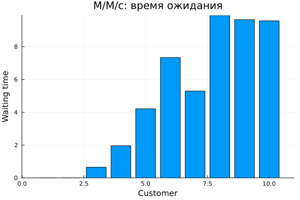
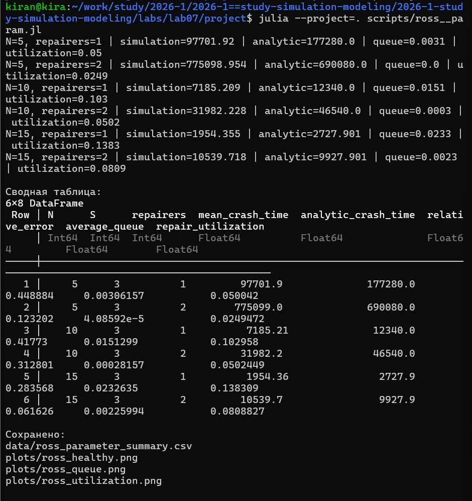
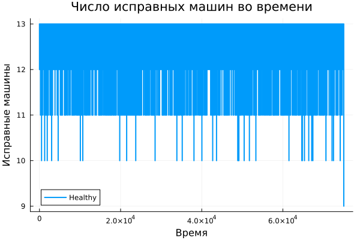
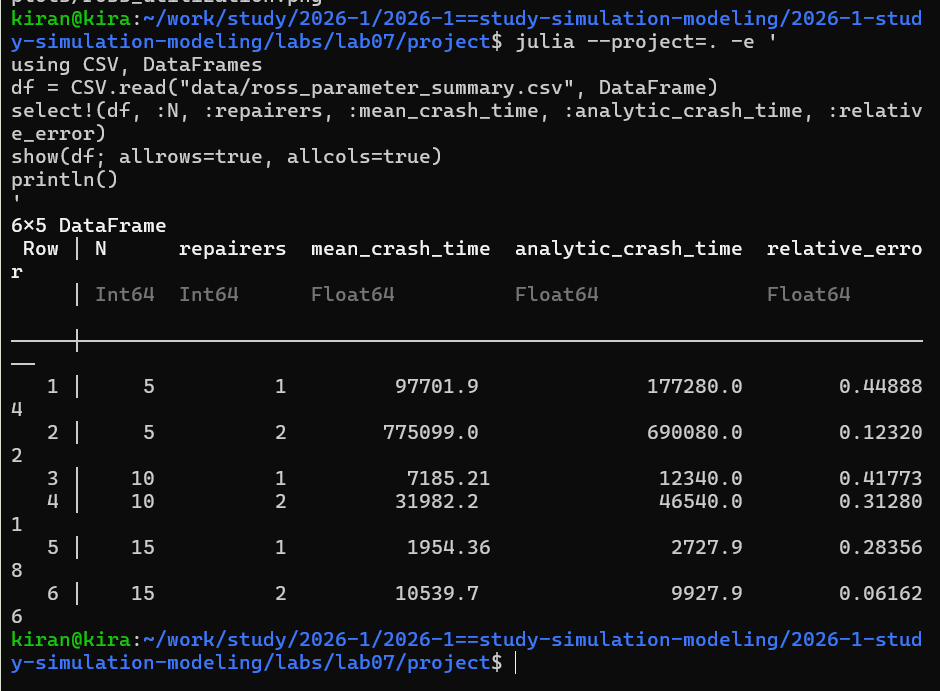
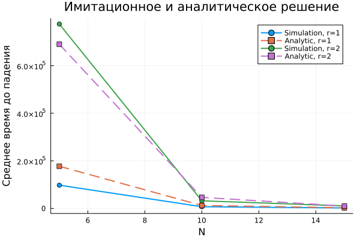
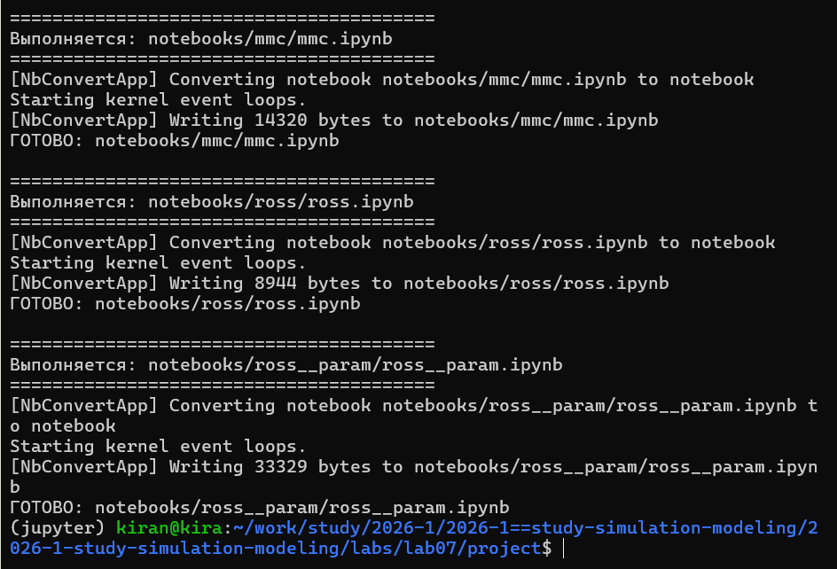

---
## Author
author:
  name: Кира Андреевна Нечаева
  email: knechaeva.git@gmail.com
  affiliation:
    - name: Российский университет дружбы народов
      country: Российская Федерация
      postal-code: 117198
      city: Москва
      address: ул. Миклухо-Маклая, д. 6

## Title
title: Лабораторная работа № 7
subtitle: Дискретно-событийное моделирование
license: CC BY
date: today
date-format: "YYYY-MM-DD" # Example: 2025-09-06
---

## Цель работы

- Реализовать дискретно-событийную модель M/M/c.
- Реализовать модель резервирования и ремонта Росса.
- Добавить мониторинг состояния системы.
- Исследовать разные количества машин и ремонтников.
- Сравнить имитационное и аналитическое решения.
- Проверить воспроизводимость вычислений.

---

## Модель M/M/c

Система содержит:

- пуассоновский поток заявок;
- экспоненциальное время обслуживания;
- несколько параллельных каналов.

В базовом эксперименте:

`10` заявок, `2` сервера.

{width=80%}

---

## События в M/M/c

{width=85%}

Каждая заявка проходит три основных события:

`arrival → service → exit`.

---

## Ожидание в очереди

{width=82%}

Если оба канала заняты, заявка ожидает освобождения ресурса.

---

## Модель Росса

Система состоит из:

- работающих машин;
- резервных машин;
- ремонтного оборудования.

При отказе работающей машины используется резервная.

Если резерв закончился до завершения ремонта, система падает.

---

## Базовый эксперимент Росса

:::: {.columns}

::: {.column width="45%"}

Параметры:

- `N = 10`;
- `S = 3`;
- один ремонтник;
- среднее время до отказа — 100 ч;
- среднее время ремонта — 1 ч.

:::

::: {.column width="55%"}

{width=100%}

:::

::::

---

## Расширение модели

По заданию исследуются:

- разные `N`;
- один и два ремонтника;
- очередь на ремонт;
- загрузка ремонтников;
- число исправных машин.

{width=84%}

---

## Число исправных машин

{width=84%}

Отказы уменьшают количество исправных машин, ремонты возвращают их в систему.

---

## Очередь на ремонт

{width=84%}

Очередь появляется, когда число одновременно отказавших машин превышает текущие возможности ремонта.

---

## Загрузка ремонтников

{width=84%}

Добавление второго ремонтника уменьшает нагрузку на каждый отдельный канал ремонта и влияет на устойчивость системы.

---

## Аналитическое сравнение

:::: {.columns}

::: {.column width="45%"}

Аналитическая модель рассматривает число исправных машин как состояние непрерывной марковской цепи.

Среднее время до отказа находится программно из системы линейных уравнений.

:::

::: {.column width="55%"}

{width=100%}

:::

::::

---

## Имитация и аналитическое решение

{width=86%}

Имитационные значения получены по нескольким случайным запускам.

Аналитические значения рассчитываются независимо по марковской модели.

---

## Литературное программирование

Из исходных литературных программ автоматически создаются:

- Julia-код;
- Jupyter Notebook;
- Quarto-документация.

{width=85%}

---

## Проверка воспроизводимости

Все автоматически созданные notebooks были отдельно выполнены.

{width=85%}

Это подтверждает, что вычислительные эксперименты могут быть воспроизведены из сгенерированных файлов.

---

## Структура проекта

{width=86%}

В проекте отдельно сохраняются код, notebooks, документация, данные и графики.

---

## Выводы

- M/M/c реализована как дискретно-событийная система с несколькими каналами.
- Модель Росса описывает отказ, резервирование и ремонт оборудования.
- Добавлено несколько ремонтников и разные значения `N`.
- Отслеживаются очередь, загрузка и число исправных машин.
- Имитационное решение сравнено с аналитическим.
- Результаты сохранены и воспроизводятся через notebooks и Quarto.
