---
## Author
author:
  name: Кира Андреевна Нечаева
  email: knechaeva.git@gmail.com
  affiliation:
    - name: Российский университет дружбы народов
      country: Российская Федерация
      postal-code: 117198
      city: Москва
      address: ул. Миклухо-Маклая, д. 6

## Title
title: "Лабораторная работа № 7"
subtitle: "Дискретно-событийное моделирование"
license: "CC BY"
abstract: |
  В данном отчёте представлены результаты выполнения лабораторной работы по дискретно-событийному моделированию.

  Рассмотрены модель массового обслуживания M/M/c и модель резервирования и ремонта Росса.

  Проведены вычислительные эксперименты, построены графики и выполнено сравнение имитационного и аналитического решений.
keywords: [дискретно-событийное моделирование, M/M/c, модель Росса, Julia, ConcurrentSim]
---

# Цель работы

Цель лабораторной работы — изучить дискретно-событийное моделирование на примере системы массового обслуживания M/M/c и модели резервирования и ремонта Росса.

В первой части моделируется поток заявок, поступающих в систему с несколькими параллельными каналами обслуживания.

Во второй части моделируется система машин, резервов и ремонтных устройств. Дополнительно исследуется влияние числа машин и ремонтников, проводится мониторинг очереди на ремонт и загрузки ремонтников, а результаты имитационного моделирования сравниваются с аналитическим решением.

# Подготовка рабочего окружения

Работа выполнялась в Ubuntu через WSL в ветке `develop` общего Git-репозитория.

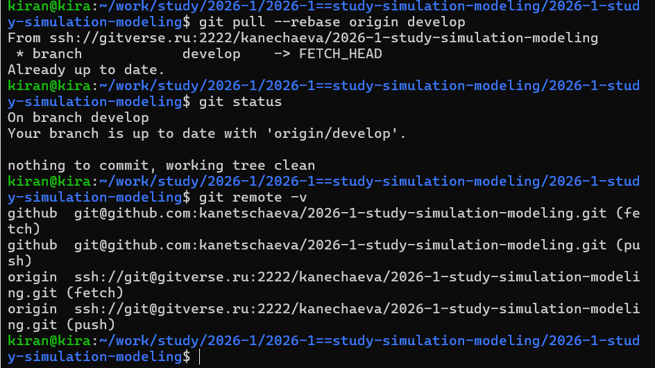{fig-align="center" width=95%}

Для реализации дискретно-событийных моделей использовались `ConcurrentSim`, `ResumableFunctions`, `Distributions` и `StableRNGs`.

Дополнительно использовались пакеты для работы с таблицами, графиками, Jupyter Notebook и Quarto.

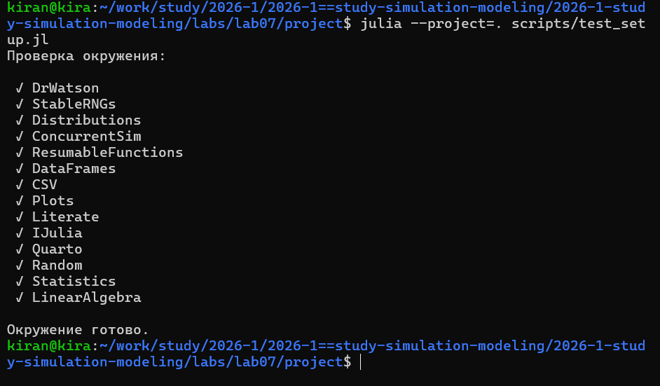{fig-align="center" width=95%}

# Модель M/M/c

## Постановка

Модель M/M/c описывает систему массового обслуживания с пуассоновским входящим потоком, экспоненциальным временем обслуживания и несколькими параллельными каналами.

В базовом эксперименте использовались:

- 10 заявок;
- 2 канала обслуживания;
- интенсивность поступления `λ = 0.9`;
- параметр обслуживания `μ = 1/2`;
- фиксированное зерно генератора случайных чисел.

## Реализация

Каждая заявка создаётся как отдельный процесс.

Сначала она ожидает момента своего поступления, затем запрашивает ресурс `Resource`. Если канал свободен, начинается обслуживание. После случайного времени обслуживания ресурс освобождается.

Дополнительно сохранялись:

- время поступления;
- время начала обслуживания;
- время выхода;
- время ожидания;
- полное время нахождения в системе.

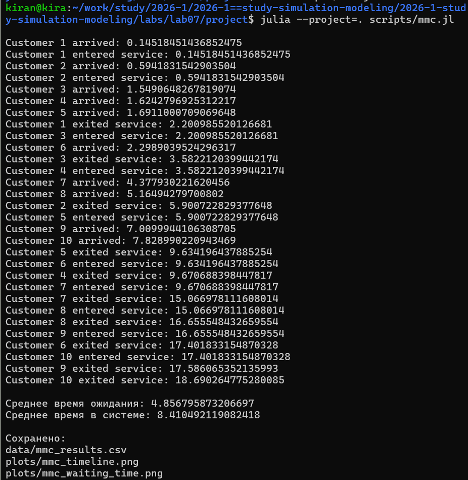{fig-align="center" width=95%}

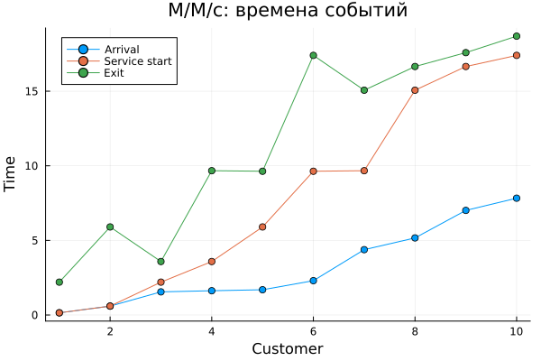{fig-align="center" width=90%}

{fig-align="center" width=90%}

# Базовая модель Росса

## Постановка

В модели рассматриваются работающие машины, резервные машины и ремонтное устройство.

В базовом варианте используются:

- 10 основных машин;
- 3 резервные машины;
- 1 ремонтник;
- среднее время до отказа одной машины 100 часов;
- среднее время ремонта 1 час;
- 5 повторных прогонов.

При отказе работающей машины предпринимается попытка взять исправную машину из резерва.

Если резерв пуст, система считается отказавшей и моделирование завершается.

## Базовый прогон

Сначала была выполнена исходная реализация модели Росса.

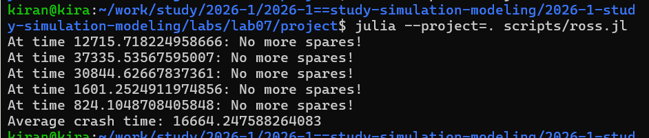{fig-align="center" width=95%}

По пяти прогонам вычисляется среднее время до падения системы.

# Расширенная модель Росса

По заданию модель была дополнена возможностью изменять число основных машин и количество ремонтников.

Использовались:

- `N = 5, 10, 15`;
- 3 резервные машины;
- 1 или 2 ремонтника;
- несколько повторных запусков для каждого сценария.

Для каждого варианта рассчитывались:

- среднее время до падения;
- средняя длина очереди на ремонт;
- загрузка ремонтников;
- аналитическое среднее время до падения;
- относительное отличие имитационного и аналитического результата.

{fig-align="center" width=95%}

# Мониторинг системы

Во время моделирования сохранялись состояния системы во времени.

Отдельно отслеживались:

- количество исправных машин;
- длина очереди на ремонт;
- количество занятых ремонтников.

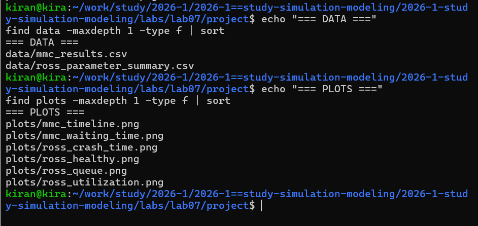{fig-align="center" width=95%}

## Число исправных машин

{fig-align="center" width=90%}

График показывает последовательность отказов и ремонтов до момента падения системы.

## Очередь на ремонт

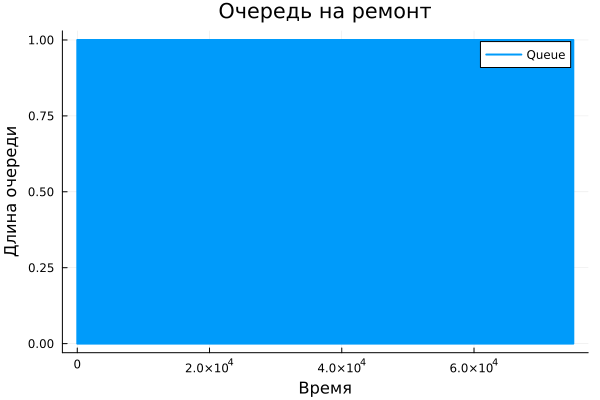{fig-align="center" width=90%}

Очередь возникает, когда отказавших машин временно становится больше, чем ремонтники могут обслужить одновременно.

## Загрузка ремонтников

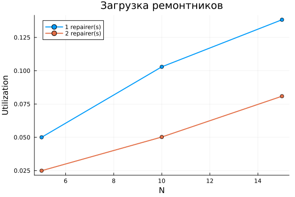{fig-align="center" width=90%}

Сравнение выполняется для одного и двух ремонтников и разных значений `N`.

# Сравнение с аналитическим решением

Для аналитического расчёта использовалось марковское представление системы.

Состояние определяется количеством исправных машин.

При отказе число исправных машин уменьшается, при завершении ремонта — увеличивается.

Система линейных уравнений для средних времён достижения состояния отказа формируется и решается программно.

{fig-align="center" width=95%}

{fig-align="center" width=90%}

Различия между отдельными значениями связаны со случайным характером имитационных запусков и ограниченным числом повторений.

# Литературное программирование

Программы были оформлены в литературном стиле.

Из исходных файлов автоматически создавались:

- чистый Julia-код;
- Jupyter Notebook;
- документация Quarto.

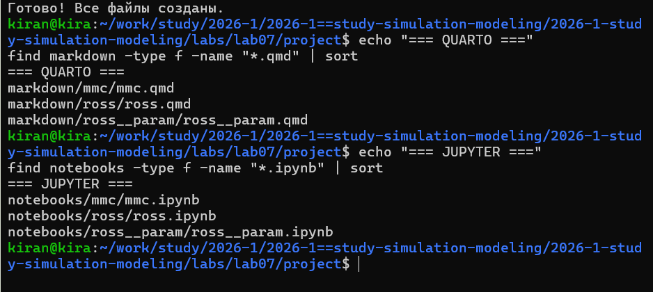{fig-align="center" width=95%}

# Проверка воспроизводимости

После генерации все Jupyter Notebook были отдельно выполнены.

Это позволяет проверить, что автоматически созданные версии способны повторить вычислительные эксперименты без ручных изменений.

{fig-align="center" width=95%}

# Структура проекта

Итоговый проект содержит:

- исходные литературные программы;
- сгенерированный Julia-код;
- Jupyter Notebook;
- Quarto-документацию;
- CSV-файлы результатов;
- оригинальные графики.

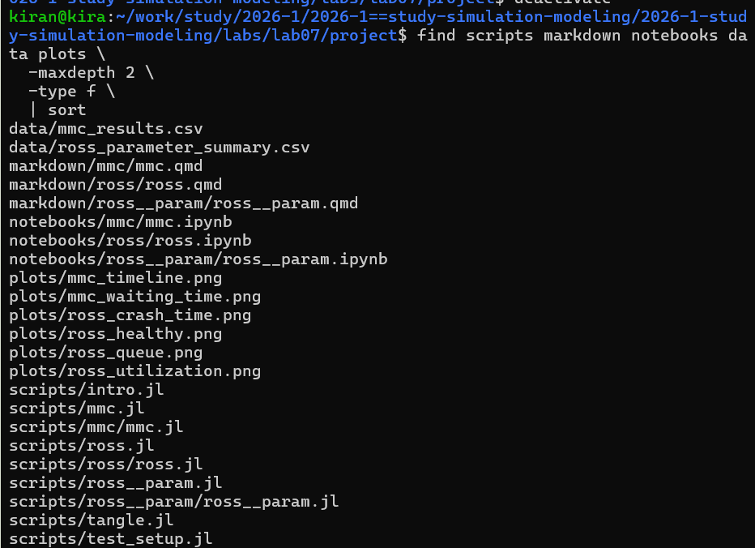{fig-align="center" width=95%}

# Контроль версий

После выполнения лабораторной работы изменения были сохранены в Git и отправлены в GitVerse и GitHub.

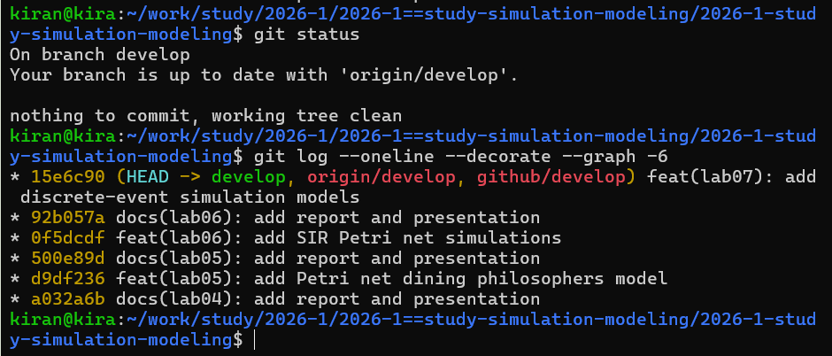{fig-align="center" width=95%}

# Выводы

В лабораторной работе были реализованы две дискретно-событийные модели.

В M/M/c каждая заявка моделируется отдельным процессом, а несколько каналов обслуживания представлены общим ресурсом ограниченной ёмкости.

В модели Росса моделируются процессы отказа машин, использования резерва и восстановления машин ремонтниками.

Расширение модели позволило исследовать влияние количества машин и ремонтников, а также отслеживать очередь на ремонт и загрузку ремонтного оборудования.

Имитационное среднее время до падения было сопоставлено с аналитическим результатом, рассчитанным программно на основе марковской модели.

Использование литературного программирования, Jupyter Notebook и сохранённых результатов обеспечивает воспроизводимость экспериментов.

# Приложение А. Документация модели M/M/c {.unnumbered}



# Приложение Б. Документация базовой модели Росса {.unnumbered}



# Приложение В. Документация параметрической модели Росса {.unnumbered}


