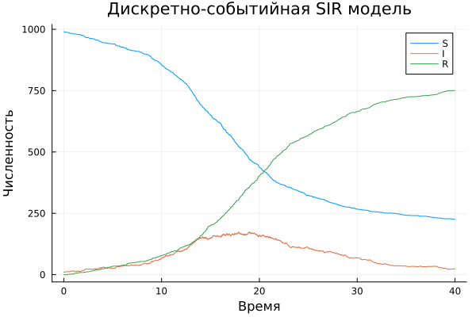
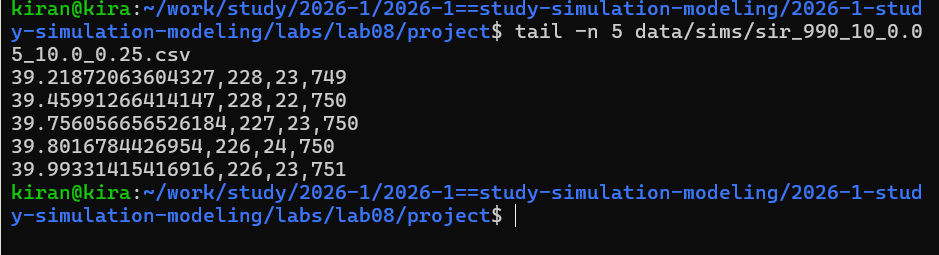
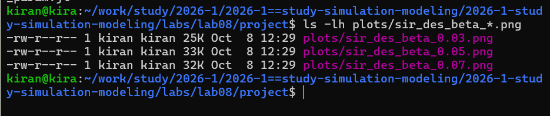
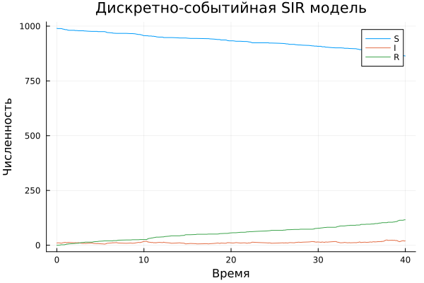
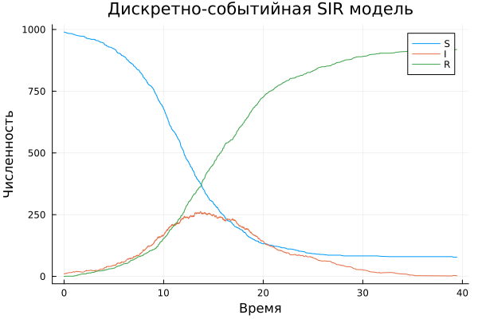
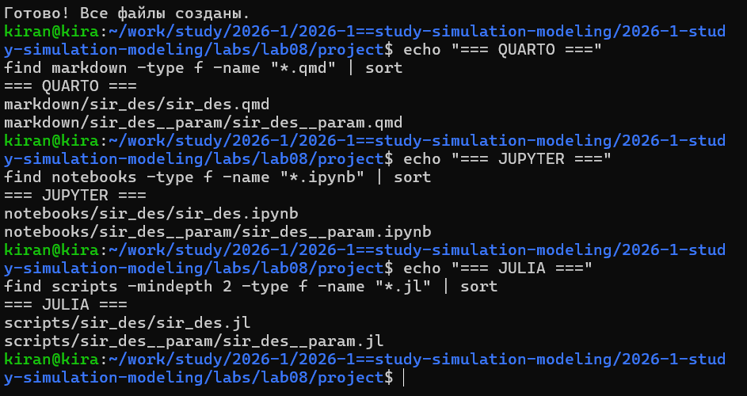
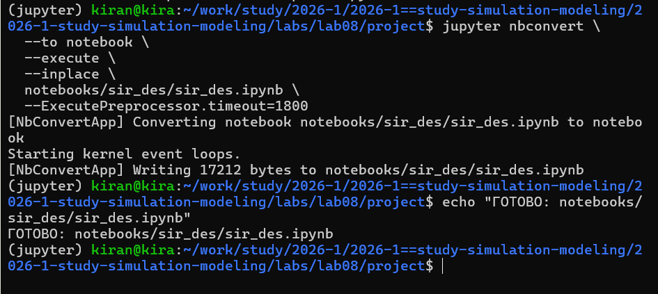
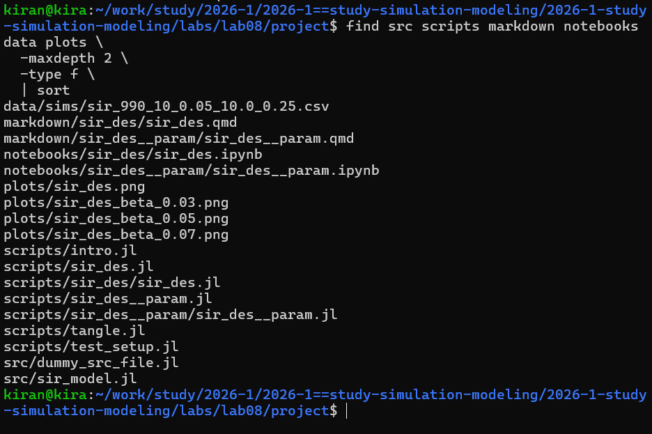

---
## Author
author:
  name: Кира Андреевна Нечаева
  email: knechaeva.git@gmail.com
  affiliation:
    - name: Российский университет дружбы народов
      country: Российская Федерация
      postal-code: 117198
      city: Москва
      address: ул. Миклухо-Маклая, д. 6
## Title
title: Лабораторная работа № 8
subtitle: Реализация модели SIR в дискретно-событийном подходе
license: CC BY
date: today
date-format: "YYYY-MM-DD" # Example: 2025-09-06
---

## Цель работы

- Реализовать модель SIR в дискретно-событийном подходе.
- Выполнить базовый вычислительный эксперимент.
- Исследовать модель для набора значений параметра `β`.
- Оформить программы в литературном стиле.
- Сгенерировать Julia, Jupyter Notebook и Quarto.
- Проверить воспроизводимость результатов.

---

## Дискретно-событийный подход

Каждый человек представлен отдельным процессом.

Состояния:

- `S` — восприимчивый;
- `I` — инфицированный;
- `R` — выздоровевший.

Состояние модели изменяется только при возникновении событий.

---

## Логика одного индивида

Для человека в состоянии `S`:

1. планируется случайный момент следующего контакта;
2. выбирается случайный другой индивид;
3. при контакте с `I` заражение происходит с вероятностью `β`.

После заражения отдельно планируется событие выздоровления.

---

## Базовый эксперимент

:::: {.columns}

::: {.column width="40%"}

Параметры:

- `S₀ = 990`;
- `I₀ = 10`;
- `R₀ = 0`;
- `β = 0.05`;
- `c = 10`;
- `γ = 0.25`;
- `tmax = 40`.

:::

::: {.column width="60%"}

{width=100%}

:::

::::

---

## Динамика базовой модели

{width=88%}

Точки временного ряда соответствуют моментам фактического возникновения событий.

---

## Почему время не идёт равными шагами

{width=88%}

`ConcurrentSim` продвигает виртуальное время от одного запланированного события к следующему.

Поэтому значения `t` не обязаны иметь одинаковый шаг.

---

## Эксперимент для набора параметров

Изменяется вероятность заражения:

`β = 0.03, 0.05, 0.07`.

При этом сохраняются:

`c = 10`, `γ = 0.25`, `tmax = 40`.

{width=85%}

---

## β = 0.03

{width=87%}

---

## β = 0.05

{width=87%}

---

## β = 0.07

{width=87%}

---

## Влияние β

`β` задаёт вероятность передачи инфекции при контакте с инфицированным.

Изменяя только этот параметр при одинаковых остальных настройках, можно исследовать чувствительность динамики эпидемии именно к вероятности заражения.

---

## Литературное программирование

Из каждого литературного исходника автоматически создаются:

- чистый Julia-код;
- Jupyter Notebook;
- документация Quarto.

{width=87%}

---

## Проверка базового Notebook

{width=88%}

Notebook отдельно выполняется после генерации, поэтому проверяется воспроизводимость базового эксперимента.

---

## Проверка параметрического Notebook

{width=88%}

Параметрическая версия также выполняется независимо от исходного литературного файла.

---

## Структура проекта

{width=86%}

Отдельно хранятся:

- ядро модели;
- литературные программы;
- notebooks;
- Quarto-документация;
- данные;
- графики.

---

## Выводы

- SIR реализована в дискретно-событийном подходе.
- Каждый индивид работает как отдельный процесс.
- Состояния меняются в моменты заражения и выздоровления.
- Выполнен базовый прогон модели.
- Исследованы значения `β = 0.03, 0.05, 0.07`.
- Созданы Julia, Jupyter и Quarto версии.
- Выполнение notebooks подтвердило воспроизводимость экспериментов.
