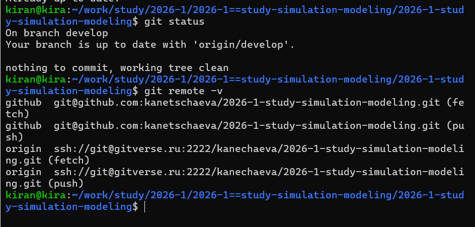
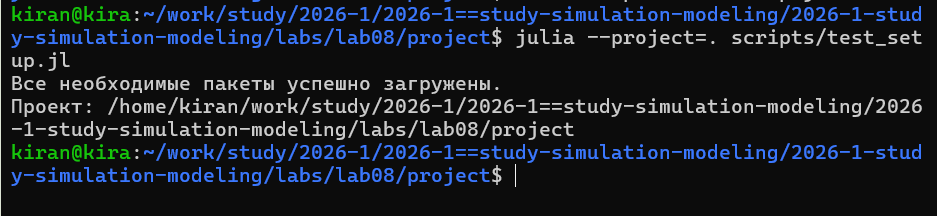
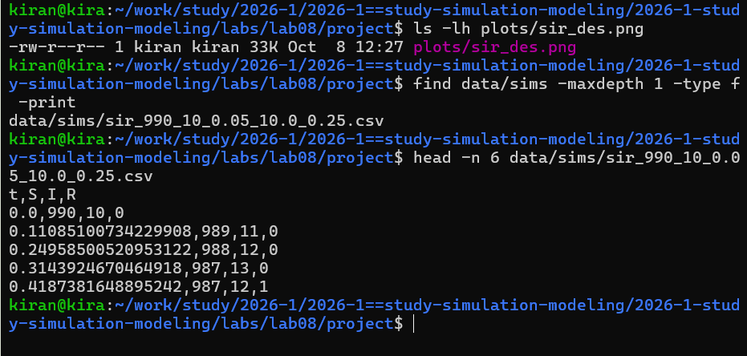
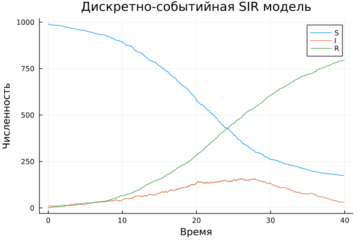
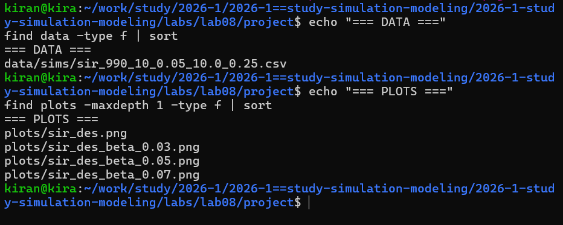
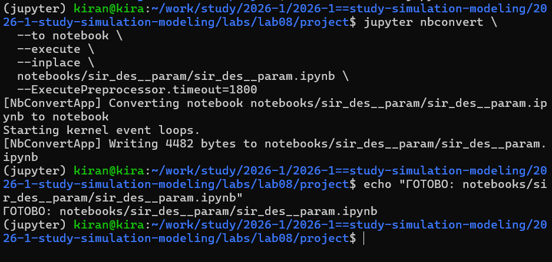
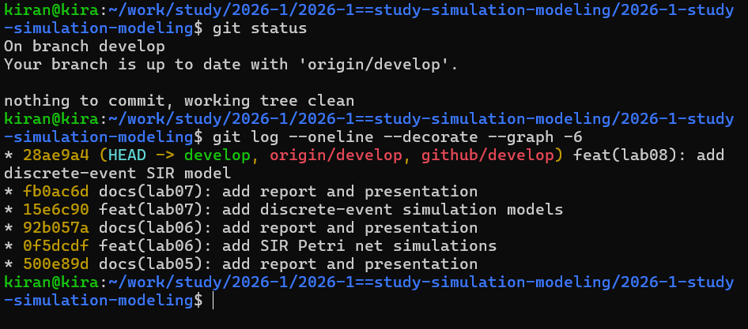

---
## Author
author:
  name: Кира Андреевна Нечаева
  email: knechaeva.git@gmail.com
  affiliation:
    - name: Российский университет дружбы народов
      country: Российская Федерация
      postal-code: 117198
      city: Москва
      address: ул. Миклухо-Маклая, д. 6

## Title
title: "Лабораторная работа № 8"
subtitle: "Реализация модели SIR в дискретно-событийном подходе"
license: "CC BY"
abstract: |
  В данном отчёте представлены результаты выполнения лабораторной работы по дискретно-событийному моделированию.

  Реализована стохастическая модель распространения инфекции SIR, выполнен базовый вычислительный эксперимент и исследована модель для набора значений параметра β.

  Программы оформлены в литературном стиле, сгенерированы версии Julia, Jupyter Notebook и Quarto, проведена проверка воспроизводимости вычислений.
keywords: [дискретно-событийное моделирование, SIR, Julia, ConcurrentSim, Quarto]
---

# Цель работы

Цель работы — реализовать модель распространения инфекции SIR в дискретно-событийном подходе и исследовать её поведение при различных значениях параметра передачи инфекции.

В отличие от непрерывной модели, состояние здесь изменяется в отдельные моменты событий. Каждый индивид представлен отдельным процессом, а заражение и выздоровление происходят во время запланированных событий.

# Подготовка проекта

Работа выполнялась в Ubuntu через WSL. Перед началом была проверена ветка `develop` и подключение к удалённым репозиториям GitVerse и GitHub.

{fig-align="center" width=95%}

Для реализации модели использовались библиотеки `ConcurrentSim`, `ResumableFunctions`, `Distributions`, `DataFrames`, `StatsPlots`, а также средства литературного программирования и Jupyter Notebook.

{fig-align="center" width=95%}

# Дискретно-событийная модель SIR

Модель содержит три состояния индивида:

- `S` — восприимчивый;
- `I` — инфицированный;
- `R` — выздоровевший.

Каждый человек представлен отдельным процессом.

Для восприимчивого индивида моделируется случайное время до следующего контакта. Затем случайным образом выбирается другой человек. Если он инфицирован, заражение происходит с вероятностью `β`.

После заражения для индивида планируется отдельное случайное время до выздоровления.

# Базовый эксперимент

Для основного прогона использовались параметры:

- `tmax = 40.0`;
- `S(0) = 990`;
- `I(0) = 10`;
- `R(0) = 0`;
- `β = 0.05`;
- `c = 10.0`;
- `γ = 0.25`;
- `seed = 1234`.

После моделирования результат сохраняется в таблицу с колонками `t`, `S`, `I`, `R`, а также в CSV-файл.

{fig-align="center" width=95%}

{fig-align="center" width=90%}

# Событийная структура данных

В модели состояние сохраняется не через одинаковые интервалы времени, а в моменты фактического возникновения событий.

Поэтому значения `t` соответствуют времени заражения или выздоровления конкретных индивидов.

{fig-align="center" width=95%}

Такое представление является характерным для дискретно-событийного моделирования: между событиями состояние системы не изменяется.

# Вычисление для набора параметров

В отдельной литературной программе было выполнено моделирование для трёх значений вероятности заражения:

`β = 0.03, 0.05, 0.07`.

Для каждого значения остальные параметры оставлялись неизменными:

- `c = 10.0`;
- `γ = 0.25`;
- `tmax = 40.0`.

Таким образом можно сравнить влияние только одного параметра модели.

{fig-align="center" width=95%}

## β = 0.03

{fig-align="center" width=90%}

## β = 0.05

{fig-align="center" width=90%}

## β = 0.07

{fig-align="center" width=90%}

Изменение `β` изменяет вероятность передачи инфекции при контакте, поэтому серия прогонов позволяет исследовать чувствительность модели к этому параметру.

# Сохранение результатов

После выполнения основного и параметрического экспериментов были проверены созданные файлы данных и визуализации.

{fig-align="center" width=95%}

Результаты хранятся отдельно от исходного кода, поэтому их можно использовать в отчёте без повторного запуска модели.

# Литературное программирование

Основная программа и программа для набора параметров были оформлены в литературном стиле.

Из каждого литературного исходника автоматически создавались:

- чистый Julia-код;
- Jupyter Notebook;
- документация Quarto.

{fig-align="center" width=95%}

# Выполнение базового Jupyter Notebook

Сгенерированный Jupyter Notebook для основной модели был выполнен отдельно.

Это проверяет, что базовый эксперимент можно воспроизвести непосредственно из автоматически созданного notebook.

{fig-align="center" width=95%}

# Выполнение параметрического Jupyter Notebook

Отдельно был выполнен notebook для серии экспериментов с различными значениями `β`.

{fig-align="center" width=95%}

Таким образом проверена воспроизводимость обеих вычислительных программ.

# Структура проекта

После выполнения лабораторной работы проект содержит:

- ядро модели `sir_model.jl`;
- литературный код базового эксперимента;
- литературный код параметрического эксперимента;
- автоматически созданные Julia-файлы;
- Jupyter Notebook;
- Quarto-документацию;
- CSV с результатами;
- оригинальные PNG-графики.

{fig-align="center" width=95%}

# Контроль версий

После завершения работы материалы лабораторной были сохранены в Git и отправлены в оба удалённых репозитория.

{fig-align="center" width=95%}

# Выводы

В лабораторной работе была реализована стохастическая дискретно-событийная модель SIR.

Вместо непрерывного изменения переменных каждый индивид моделируется отдельным процессом, а состояние системы меняется при наступлении событий контакта, заражения и выздоровления.

Был выполнен базовый эксперимент с фиксированными параметрами и отдельная серия запусков для значений `β = 0.03, 0.05, 0.07`.

Результаты сохраняются в таблицы и графические файлы.

Основная и параметрическая программы оформлены в литературном стиле. Из них автоматически получены Julia-код, Jupyter Notebook и документация Quarto. Оба notebooks были выполнены отдельно для проверки воспроизводимости.

# Приложение А. Quarto-документация базовой модели {.unnumbered}

Ниже приведена документация, автоматически сформированная из литературного исходного кода базового эксперимента.



# Приложение Б. Quarto-документация параметрического эксперимента {.unnumbered}

Ниже приведена документация, автоматически сформированная из литературной программы для набора параметров.


